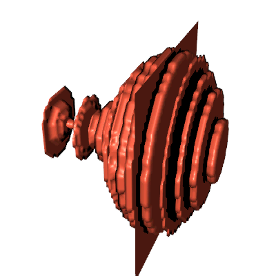
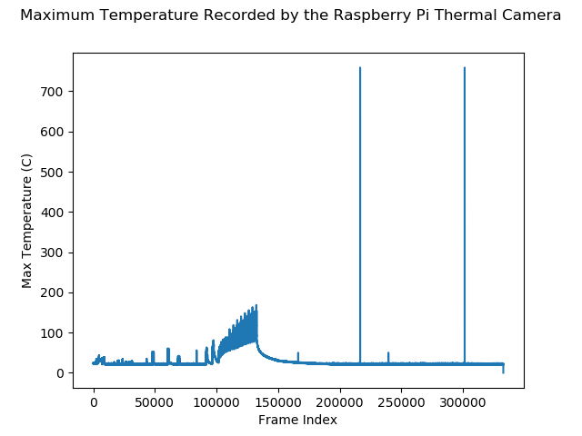

# 3D Thermal Reconstruction

This folder is related to generating 3D data from the Raspberry Pi thermal camera. The goal is to estimte characteristics
of the heating area such as volume, surface area and internal temperature distribution. This is likely to be related to the
melting pool size. It's also an opportunity to see what can be done with low resolution data.

## Requirements
 + Python v3+
 + OpenCV v4.1.0
 + Matplotlib (with Axes3D)
 + VTK

## Basic Principle

The basic idea is to take the 2D thermal camera data and rotate it to form a 3D point cloud from which a volume and correspondingsurface can be extracted. To narrow down the area of interest to where the major thermal artifacts are, some preprocessing is required. 

A combination of Sobel Edge detection and Ostu thresholding is used to identify the region with the most activity. It is known from visual inspection that the interesting data occurs in a narrow column range of 15:25 so the Sobel results are masked down to that range. Otsu thresholding is then used to create a mask that only selects the values of interest. As this region of interest in this mask tends to have holes, the morphological transform of Opening is applied to close any holes and create a better mask. Contour detection is then applied to the mask and the largest contour selected as this likely represents the artifact of interest. A
bounding box then fitted to this contour and used to mask image. This bounding box is then cut in half vertically and the right half of data is selected. It is known from earlier experiments that the heating distribution of the laser has similar characteristics to a Gaussian with a heating area
of minimal eccentricity (mostly circlular and uniform). As such the sub surface heating distribution is assumed to be equally
uniform and symmetrical.

As the original image is 24x32 pixels, the resolution of the identified bounding box tends to be in the order of 5x5 to 10x5 pixels.
In order to improve the resolution of the data, an RBF (Radial Basis Function) is fitted to the data to interpolate between the 
values. Below is an image showing the results of different RBF methods fitted to the data. The data has been interpolated with 
twice the resolution of the bounding box. The script to generate the image and inspect other frames is [here](temperaturerotationdata_rbf_compare.py).

The RBF is fitted using Scipy's Rbf [class](https://docs.scipy.org/doc/scipy/reference/generated/scipy.interpolate.Rbf.html).
The titles on the plots reflects the name of the function used in the Rbf.

The image in the bottom left if the 2D temperature data cast into an 8-bit image for display purposes. The red box is the detected
bounding box and the green cross is the peak in the image. The axes above it shows the data in the right half of the bounding box
and the grid of axes to the left of that is the RBF results fitted to the data.

**NOTE: The y-axis in the RBF results is the opposite to the scatter data shown**

Using the script it can be seen that multiquadric, inverse and gaussian tend to retain the general behaviour and artifacts across
the interpolation. For the other examples shown, assume multiquadric is used for the RBF unless stated otherwise.

Once interpolated, this sheet of values is then rotated using a rotation matrix about the y-axis to form a 3D point cloud set.
The resolution of the rotation is typically 10 degrees unless specified. An investigation on the impact of the rotation
resolution has not been performed as there is currently no quality metric by which to validate the results.

The method described is shown below as a block diagram.

The methods used to investigate the point cloud and surface fitting techniques are described in the 3D Rendering sub section.

## Limitations

Obviously there are several ways by which this method can be adjusted and improved. Below is the list of the most noted ones
during investigation.

 + Choosing the appropriate interpolation resolution
 + Evaluation the correct RBF method by a quality metric
 + Improving or modifying image pre-processing methods
 + Choosing a different way to partition the data
 + Select the data inside the target contour rather than the bounding box
 
## 3D Rendering

The goal at this stage is to take the 3D point cloud data and process is such that we have a 3D object representing the sub-surface heating area being affected by the laser. With this, the melt pool volume and area can be estimated. This would require
corresponding volume estimates in order to corroborate the results and the relationship between pixel size and estimated
physical size. Normally estimating the precise volume would require setting up and running a finite element model which takes considerable time and effort.

To process and handle the 3D rendering the library VTK (Visualisation Toolkit) is used. It was chosen due to its flexibility, reliability, current range of supported methods and native GPU support.

**Note The datasets used to test and build this code was recorded with the camera at an unknown angle relative to the baseplate.
As such, the pixel pitch is unknown and a related variable is currently not included in the data**

One of the problems with using the bounding box to mask data is the amount of noise and "dead space" it brings with it. This introduces the additional requirement of identifying the edges in the 3D dataset.

A common method used in this project to filter the data is to only show a percentage of the temperature range.

A limit is calculated as a percentage of the frame's temperature range and only the temperature values that are above this limit are passed on for rendering. This is obviously a brute force technique to filter data but at the time of writing a method has yet to be found that correctly finds the edge of the heating shape amongst the noise of the background. Smarter methods would involve selecting similar temperature values close to each other physically. This could be achieved a number of ways, for example:
 + Clustering algorithms
 + Binning the image to improve the edge detection methods
 + Binning the image and selecting the bins that satisfy a certain criterion

### Methods
#### Delaunay Triangulation
The idea for Delauny Triangulation is taking a set of points and constructing triangular faces between sets of points to build up a surface of the convex hull. The advantage with it being used in this case is the data doesn't need to be converted or interpolated into a volume requiring; the rotated dataset can be passed directly. The issue is then limited to how to filter the data to best present the data.

The GIF below shows an example of frame 91399 filtered with a factor of 0.6 and a surface fitted to the data. In this case the result is quite smooth with no spurious faces or artifacts. However during the rendering process, VTK does produce a number of errors and warnings. The warnings advise that the datatype is not VTK_TRIANGLE while the errors note between 40-60 degenerate triangles in the surface.

In order to estimate the surface area and volume, the rendered data is passed through a number of filters before being of the appropriate type for the vtkMassProperties class.

Artifacts and clearer evidence of degeneration and a lower quality mesh begin to occur as we iterate over more frames. The GIF below shows a timelapse of the Delaunay surfaces fitted to frames 91399 to 150000. 

For some reason animating it doesn't produce as higher quality surfaces as the original GIF. This may be due to the data pipeline not completing its process before the next frame call. 

You can clearly see overall lower quality surfaces and artifacts begin to aear in the surface. These artifacts include separation between the upper and lower portions of the surface (laser and sub-surface heating area), forming of small faces that don't connect with the larger shape and a clearly incorrect overall shape. The small surfaces that form separate from the overall shape are likely pieces of data that weren't filtered properly. When the laser is far away from the camera, the recorded heat is of a similar magnitude to the background noise. As such it can be expected for interpolation methods to occasionally draw connections that deform the surface. Furthermore, Delaunay is designed to work with convex hulls and cursory examination of the data shows it is destinctly non-convex.

As VTK has some measure of the number of degenerate triangles, it could be used as means of optimising the filtering factor, informing the choice of RBF or acting as a confidence metric for the surface in a similar manner to how VTK suggests using Projected Volume as a means of checking Volume from vtkMassProperties. To avoid suboptimal cases, the size of the filtered dataset and the number of enclosed shapes will likely have to be monitored to steer away from them.

#### Gaussian Splat, [basic script](vtk_rotation_gaussiansplat.py),[animation script](vtk_rotation_gaussiansplat-animate.py)

Gaussian splat is a means of interpolating between data to create a volume. However, rather than linearly interpolating or using a similar function to work out the data, it instead distributes a volume of points between known data points. How the data is distributed is decided according to an elliptical Gaussian distribution function. This effectively converts a collection of data points or point cloud into a volume allowing us to estimate the volume of it. Furthermore, this method also interpolates the temperature values showing us how the temperature is distributed across the volume.

Using the previously described method, the 2D thermal camera image is converted to a 3D array of data. The data is interpolated and converted into a volume using VTK's [vtkGaussianSplatter](https://vtk.org/doc/nightly/html/classvtkGaussianSplatter.html#details) class. A color map is then generated by generating equally spaced temperature values across the dataset temperature range, normalizing them and feeding them into one of Matplotlib's [colormaps](https://matplotlib.org/3.1.0/tutorials/colors/colormaps.html). The RGB values are then fed into VTK's [vtkColorTransferFunction](https://vtk.org/doc/nightly/html/classvtkColorTransferFunction.html) class which takes the values given and interpolates between them to generate a complete set. This colors the data and provides a good sense of temperature distribution. The color map shown in the GIFs below is Hot.

The GIF below shows the interpolated volume of frame 91399 being clipped with a plane. The plane is like a knife cutting a slice out of a cake revealing the different layers and how the ingredients are distributed. Normally the clipping plane is placed half way through the volume but the animation shows how the visualization changes as the move the clipping plane across the volume.

The animation below shows how the interpolated volume changes as this tolerance is varied. In general 60% (or 0.6) seems to remove most of the background noise without any obvious degredation. However, either due to the symmetry assumption when rotating or the fixed nature of the tolerance separate artifacts separate from the main volume are sometimes rendered.

See the section on Filtering Methods to show how else the data could be filtered.

The main factors that affect the distribution are radius of the major axis, eccentricity between the axes and exponent factor. These affect how far the "splat" spreads, how quickly the temperature changes over that distance and how it spreads over the respective axes.

The animation below shows how changing the radius affects the results. The radius is started at a 0.01 and is increased up to 0.51. In general, a radius of 0.5 is used.

One of the difficulties with selecting the correct radius is that the data points are not equally spaced as a result of the rotation. Towards the centre of the volume, data points are bunched close together while towards the edge they are spaced futher apart. The resolution when rotating the data points could be increased (from 10 degrees) but this drastically increases the number of data points need to be rendered.

This animation shows the volume sliced down the middle and the camera rotating around it.

#### Marching Cubes + Flying Edge

Marching Cubes and Flying Edges are algorithms designed to extract surfaces from point cloud data. Both extract a surface from a 3D scalar field commonly known as a voxel. Voxels can be viewed as a set of cubes containing a zero or one indicating whether the space is occupied. As the rotated data set isn't equally spaced it cannot easily be converted to a voxel space. Instead the original thermal images are passed to these algorithms. The recorded thermal images are normalized with respect to the dataset temperature limit, cast to 8-bit and saved as PNGs. As the original images are 32x24 pixels, the Waifu2x scaling network has been used to scale up the images. This provides an opportunity to test Waifu2x on the real IoT data and observer the impact whilst providing a higher resolution dataset that is more beneficial to the algorithms. Only the frames 91399 to 150000 are passed as you can clearly see the boundaries of the heating area and are likely to result in better results.

When processed, the results are stacked together to form a 3D shape. The data has been colored so that is partially translucent and white indicates higher temperature values. The images below show the results of Flying Edges Algorithm.

Below is a GIF showing a camera flying through the centre of the stack produced using the Flying Edges algorithm.

The highlighted areas closely resemble the shape of the heating area and show how the heating area changes over time. Verifying the quality of the results would require knowing the melt pool area and checking that the estimated area of the generated surface is reasonable relative to this.

#### Surface Reconstruction Filter

## Estimating Volume

When converted to a 3D volume, VTK has the tools to estimate the physical volume and surface area of the shape. Obviously different interpolation and rendering methods will generate different results so choosing the best method would require reference data to confirm which is closer. At this stage that type of data is not available so any evaluation is based on common sense about the volume (i.e. value clearly plausible given the known dimensions of the observable area) and any commonality to the dynamics of other variables (e.g. volume decreases as the nozzle moves further away).

The following data was collected during the recording of the timelapse animations shown earlier. A VTK class [vtkMassProperties](https://vtk.org/doc/nightly/html/classvtkMassProperties.html) was set up to calculate the triangulated surface of the data. The results are passed through a [vtkGeometryFilter](https://vtk.org/doc/nightly/html/classvtkGeometryFilter.html) and a [vtkTriangleFilter](https://vtk.org/doc/nightly/html/classvtkTriangleFilter.html) before passing it on. Everytime the index being rendered is changed, the class is updated and the Volume, Projected Volume and Surface Area area are written to a CSV file. The CSV files are available in this [folder](VolumePlots/Data). As the current pixel pitch is not known, the units are assumed to be in pixels (i.e. volume is pixels^3 and and surface area is pixels^2). If pixel pitch is known, it can be converted to a more relevent unit such as m^3.

Projected Volume is used to compare against Volume to indicate an error such as incomplete surface or the data contains triangles that have been flipped. This comparison has **not** been performed.

The data was plotted using the command line script [plotmassprops.py](plotmassprops.py). The x-axis is data index and the y-axis is the respective unit.

### Delauny 3D

**NOTE: The following data is for an incomplete run. The Delauny 3D animation [script](vtk_delauny3d_animate.py) crashes during the run with no message indicating the renderer crashes on certain frames**

### Gaussian Splat Contoured

### Flying Edge Surface Area

