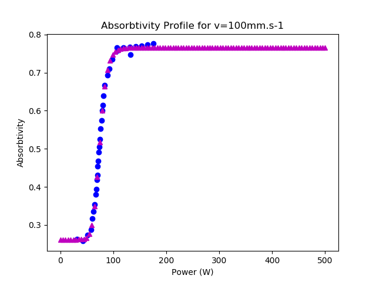
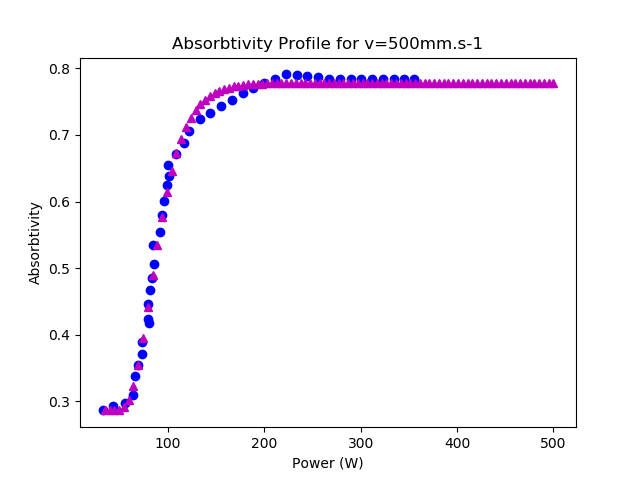
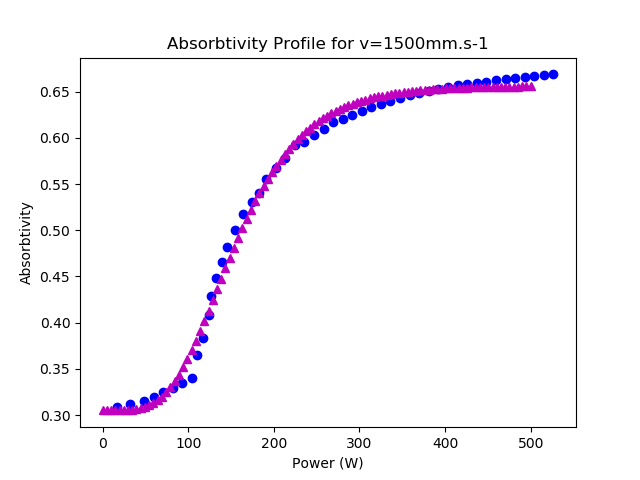
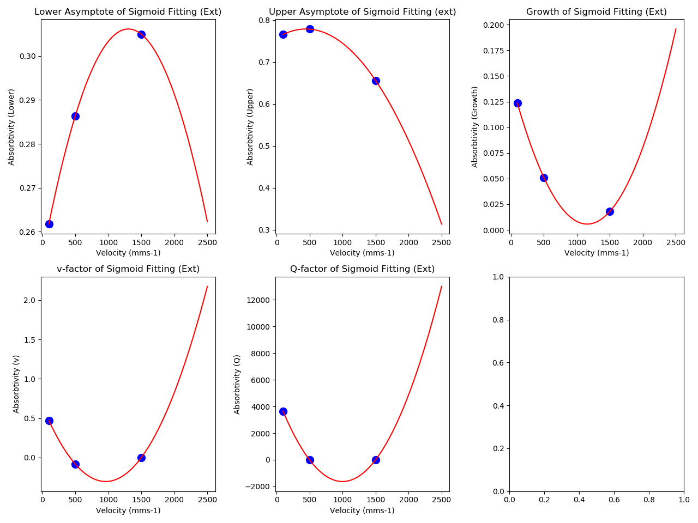

# Absorbtivity Prediction Data
Based off the work from In situ absorbtivity measurements of metallic powders during laser powder-bed fusion additive
manufacturing, Trapp et. al., 2017
## Summary
* Absorbtivity is difficult to measure
* Paper proposes methodology for estimating it from temperature, size and specific heat capacity function
* Produces three graphs showing absorbtivity for a known track velocity over a power range.
  * Velocities are 100, 500 and 1500 mms-1
## Author's Notes
* Given limited knowledge of the material Stainless Steel 316L, I don't feel completely comfortable using the current specific
  heat capacity data and fittings
## Program
* The graphs given in the paper were digitized using [WebPlotDigitizer](https://apps.automeris.io/wpd/) and the data written
  to CSV files
    * CSV files provided
* A sigmoid is fitted to each plot and the estimated parameters were saved to a file
    * Parameters:
      * Lower Asymptote
      * Upper Asymptote
      * Growth
      * Q
      * v
      * As named in [article](https://en.wikipedia.org/wiki/Sigmoid_function)
* A quadratic is then fitted for each sigmoid parameter
    * Only 3 points are known for each parameter so it seemed a reasonable starting point
    * Other fitting functions could be used
    * The fitted parameters are saved to a file so it can be read in other programs
* The parameter functions are then used to generate absorbtivity power curves for a range of velocity values
## Files
* Program file
* CSV files of graph data
* Text files of the sigmoid parameters for the specified velocities
* Text file of the Quadratic parameters for the sigmoid parameters
* Images of the plots for the stages mentioned
## Plots
Below are plots of the fitted data versus fitted function.

Below is a plot of the fitted parameters for each velocity.

## Author Notes
* Only three data points used for fitting of parameters
* Quadratic assumes an eventual upward/downward trend
* Parameters are saved to files so the functions can be recreated and used in other files
