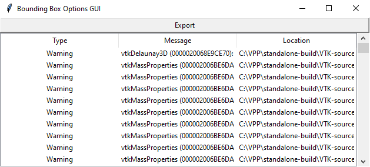

# Bounding Box GUI

This folder contains the scripts for a GUI that allows the user to investigate the impact of choosing different regions of the bounding box as the data rotate.

**WARNING: This code was built around VTK NOT having Tkinter support. This requires the VTK Render Window instance to be managed separately and rebuilt repeatedly.**

## Background

The current method for generating a 3D rendering of the heating area involves detecting the boundary of the area as a bounding box, selecting a portion of the data inside the box and rotating an interpolated version of it to form a 3D point cloud. Normally the right-hand half of the bounding box is selected with the middle as the geometric half of the box. The choice to use those reasons is a somewhat arbitrary one based around the assumption that the data is symmetrical. The impact of choosing different regions has not been investigated throroughly.

This GUI provides a way for users to investigate the impact of choosing different regions and the impact it has on the rendered 3D shape, whether it improves it, shows less data can still achieve a good result and what happens if you change the centre of the bounding box.

## Requirements
 - Python v3+
 - VTK
 - Tkinter, TTK
 - Numpy
 - Scipy
 
## Features
 - VTK messages are captured and stored in a Treeview instance that can be viewed
 - Export captured VTK messages to an arbitrary file
 - Access and display the contents of thermal camera HDF5 footage
 - Display the results of the processing to show the target region for 3D rendering
 - Clickable canvas allows user to selection what portion of the target region to use as source data for 3D rendering and estimation.
 - View the estimates surface area and volume of the rendered shape
 - Change the color of the rendered shape and background it is drawn on
 - Slider allows for easier selection of frames
 - The data file is only accessed for how long it takes to get a frame of data allowing the user to change the file elsewhere and view the impact.
 - Take and save screenshots of the VTK render window and save them to a set folder
 - Screenshot button has custom icons
 
## Bugs
 - VTK window cannot be reopened when closed.
 - VTK Rendering window crashes on certain frames.
 - Warning is printed when clearing Background and Delauny color using options menu
 - Multiple options menus can be opened.

## Usage

### Opening and viewing a file
Select File->Open New HDF5 to select a new HDF5 file to inspect. Once found, the first frame of the file is processed and displayed and the slider for selecting frames is updated to the number of frames. Click and move the slider to choose a different frame to inspect.

The objects drawn on the frame represent the following

 - Red rectangle : Bounding box surrounding largest detectable contour
 - Green star/cross : Pixel with the highest magnitude
 - Blue line : Line showing where the middle of the bounding box under the current settings is
 
### 3D Rendering
With a file successfully opened, click a maximum of **2** adjacent regions on the canvas on the right hand side. These regions will decide which portion of the data inside the red rectangle to use as a reference when rotating and interpolating to a 3D shape. Once selected, either move the slider to the next frame or click the Render button to render the current frame and wait for the rendering process to complete. A separate window will appear showing the rendered shape. Please refer to [here](https://kitware.github.io/itk-vtk-viewer/docs/shortcuts.html) for the keyboard shortcuts and controls for the render window.

**NOTE: The rendering process can take a while to finish. Be patient**

**NOTE #2: The program can and will crash with certain frames of data. The current cause is unknown**

### Viewing the VTK log
Once finished with the VTK window, close it by clicking the red X in the top right hand corner. To access the log, click on View->VTK Log and a separate window will appear showing the currently recorded entries. Below is an example of the window that will appear.

The entries are parsed into three columns; message type, contents and location. The messages are generated by a range of classes inside the program. Type refers if the message is a warning or an error. The class currently only captures and displays these two types. Contents is the informative part of the message and the location is what library script has generated the message.

If the user wishes to export the log to a file, click the Export button above the log and follow the instructions in the dialog. The file is written as shown with the colums delimited by a comma. An example of an exported log file as a text file can be found [here](logtext.txt)

### Viewing Estimated Volume and Surface Area

The output of the Delaunay triangulation is fed through a series of objects into an instance of vtkMassProperties. This class calculates the estimated volume, projected volume and surface area of the last rendered object. To access this information, click on View->Mass Props and a small window will be created showing the current values.

**NOTE: As the VTK render window takes control of the main thread and the VTK objects aren't created until the first render, the mass properties window is not updated regularly.
**NOTE #2: On closing the window, the render window class needs to be rebuilt/reinstantiated. This is currently not performed automatically as an appropriate method to determine if the window is destroyed/closed has not been found.

### Changing Options

To change certain options associated with the program click Options->Open Menu. This will create a window will several tabs grouping the options under certain headings. 

The File tab contains the file paths of the current HDF5 file being viewed and where the VTK screenshots will be saved to. By default, both are initialized to the current working directory to provide a hopefully easier starting point for customising. The buttons at the end of the text box open a dialog allowing the user to update each path.

The Data tab contains values related to the processing of the temperature data. Current parameters are:

 - Filter : A parameter used to filter the rotated 3D data before updating the dataset used in rendering. The formula used in filtering is as follows. The data is filtered to those whose temperature values are above the minimum temperature plus a percentage of the temperature range
 

 - Rotation Resolution : The resolution at which the data is rotated about the y-axis. The lower the resolution, the more data is produced and the longer the rendering time. If you have a machine with a low amount of memory, leave it on default or increase.

The VTK tab contains the current render window background color, the color of the rendered object and the size of the VTK rendered window. Each is a tuple of three numbers representing a RGB color on a 0.0 to 1.0 scale for each channel. The numbers are forcefully kept within this range and will overwrite the user's input if necessary. Once changed to a satisfactory new color, click the Update button next to the respective variable to update it for next use.

### Impact of choosing different regions

The main purpose of this GUI is to demonstrate the impact of choosing different regions of the bounding box to use as the rendering data. The choice greatly affects the shape and dimensions of the end shape including volume and surface area which might be of interest. Below are images showing the impact of choosing different combinations of regions on the rendered result. 

|                                                   |                                                  |
| :--:                                              | :---------------------------------------:        |
|    |      |
|  ||
|| |
|||
