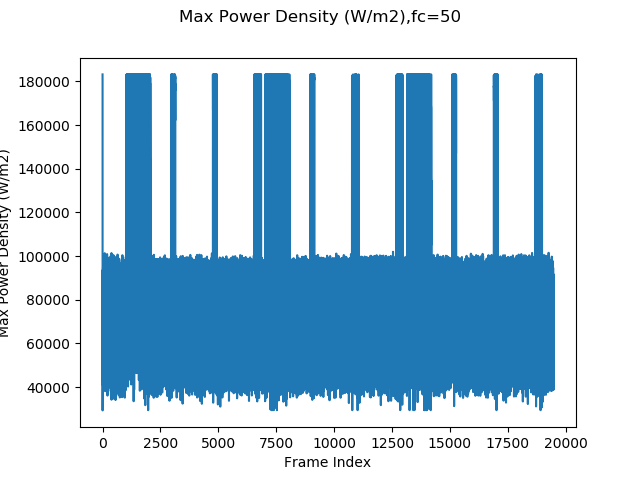
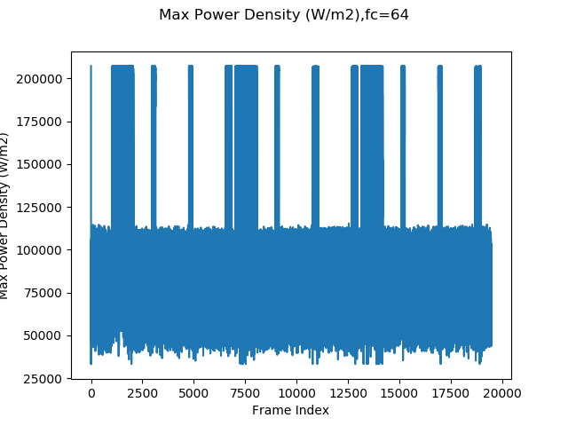

# Impact of Thermal Camera Frequency on the Predicted Behaviour

The camera frequency is used to calculate the amount of power needed to cause the predicted temperature change. The inverse of the frequency is used meaning the amount of time between frames. As the actual camera frequency has not been confirmed, it is of interest to investigate the impact of the camera frequency on the model.

All scripts in this repository has assumed that the camera frequency is 64 FPS. The thermal camera has a frame rate range of 50 to 64 FPS.

## Impact on Power Density

Power density is the amount of power needed to raise the temperature for that region of space from one value to another. It requires the amount of time between samples as a shorter period of time would mean more power is required and a longer time would demand less power.

The power density was calculated across the entire data set for different frame rates starting at 50 and increasing by one up to 64. The plots below show the peak power density for each instance for 50 FPS and 60 FPS. The remainder of the plots are stored in the folder.

As can be seen, there's a difference of around 20,000 Watts per metre squared which for a pixel of size 20x20 micrometres is a difference of 0.000008 Watts per pixel.

The impact on the power estimate depends on the method being used.
