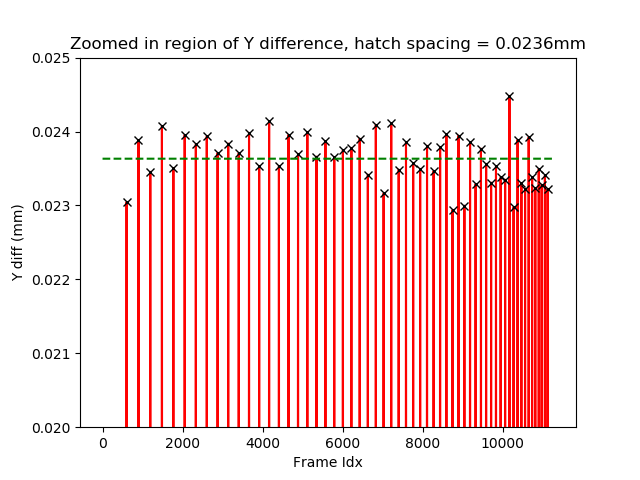

## Estimating Hatch Spacing from XML Data

# Definitions
Hatch Spacing : Distance between the centres of tracks created by the laser during a run

Source: Review of selective laser melting: Materials and applications, Chor Yen Yap et. al.

Hatch spacing has an impact on the overall quality of the product and other important process parameters such as porosity.

The XML log file records the laser's position, torque and velocity over a fixed duration. Plotting the data shows that the X position and the motor velocity data tends to vary the most and in very specific intervals. As the shape of the product is an arrow, it can be inferred that this when the laser and material is being applied. It can also be deduced that the laser's tracks also follow along the x-axis. As the product is primarily built along the XY-plane, the hatch spacing will be the change along the Y-axis during these period of activity.

The attached script finds the hatch spacing by focusing on the first period of activity and finding the average of the changes in the Y position over this period of time.

The algorithm is as follows:
  + Load in and parse log file from a hard coded location
  + Find the element wise difference between the data sets (e.g. x[1]-x[0])
  + Extract the region of data previously decided on
  + Find the peaks in the Y position difference data using the find_peaks function in the signal module of SciPy
  + Filter the peak values by those with a magnitude above 0.001
  + Calculate hatch spacing as the average of the filtered peak values
  
The average is a reasonable metric for this as the Y difference data does not vary greatly over the period of activity as can be seen from the attached plots

## Developer Notes
  + For a more generalised solution, a method of detecting periods of activity needs to be created. 
