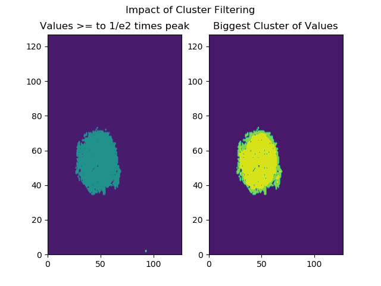
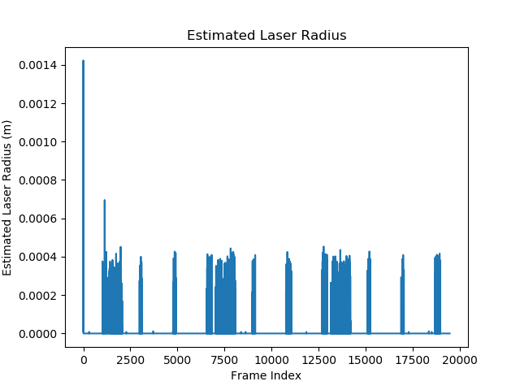
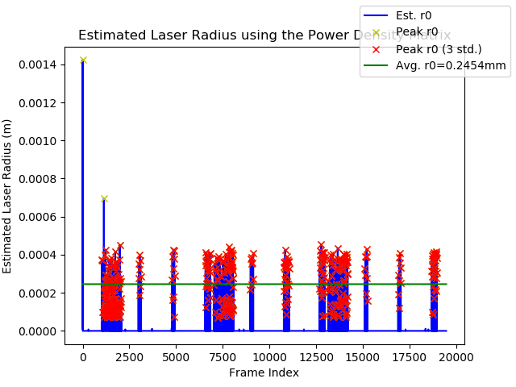

# Estimate Laser Radius
The attached script estimates the laser radius using the predicted laser density matricies and the 1/e2 method.
## Requirements
 + [Numpy](https://www.numpy.org/)
 + [SciPy](https://www.scipy.org/)
 + [OpenCV2 v4.x.x](https://opencv.org/)
 
## 1/e2 method
The goal is to find the distance between two points that are 1/e2 (e being Euler's number) times the peak of the matrix.

## est_R0 Function Steps
 + Find all values that are greater than or equal to 1/e2 times the given frame's peak
 + Search for the values that are together in a cluster
 + Find the boudary of this cluster
 + Calculate its area and convert it to metres squares (m2)
 + Treating the area as an area of a circle, calculate and return it's radius.
 
The filtering for the largest cluster of values is to remove any collections of outliers that might cause a false contour
to be detected. The function uses the largest contour it can find and assumes it to be the values of interest. If enough
outliers are near eachother, there's a chance that a contour around these values could be detected.

The impact of the filtering can be seen in the following plot. The plot on the left is all the values that are above or
equal to 1/e2 times the peak. The plot on the right is the results after searching for the cluster.

 
The plot below is the function applied to the arrow data set.

 
## Program
The program uses the function to calculate the estimated laser radius for each power density matrix. Using all the estimates,
it filters the values of outliers such as overstimations or strange values in the data and calculates the average to return
the laser radius for the data.

### Data Processing
The program filters the data by first finding all the peaks in the data. The peaks are where the function has successfully returned a value usually when the laser is turned on. The peaks are then filtered by those that are greater than 5% of the maximum in the data set. Occassionally the function returns an incredibly small number when the laser is turned off, much smaller than the majority of values. The peaks finding function also picks up these values and we don't want them messing up the average. The 5% tolerance is arbitrary but tends to work. An alternative statistical metric could be used.

The data is then filtered again for those within three standard deviations of the mean. On the plot, it can be seen that there are
two distinct outliers in the data. One very early on in the data and another a bit further. The first outlier is due to a sudden,
unexplained spike in the original data that occurs on the second frame of data. A cause has yet to be determined. The second
outlier is currently assumed to be an overestimation. Either way, searching for values within three standard deviations is a 
statistically valid means of filtering.

The laser radius of the dataset is then taken as the average of the filtered data. The plot below shows the results of that 
filtering and a line indicating the filtered average.

The red X's indicate the peaks within three standard deviations of the unfiltered mean and the yellow X's indicate the outliers.

### Developer Notes
This method is not the most accurate. While the shape of the group of values above 1/e2 times the peak is mostly circular,
the assumption that the contour area is that of a circle can be a very broad approximation

There is a more accurate D4Sigma method based of standard deviation of the data, but it
can overly weight the wings of the distribution and thus requires some additional preprocessing. This method was chosen as it
easier to implement. [See here for more information](https://www.ophiropt.com/blog/laser-measurement/calculate-laser-beam-size/)

Other estimating method and variations will be added at a future date.
