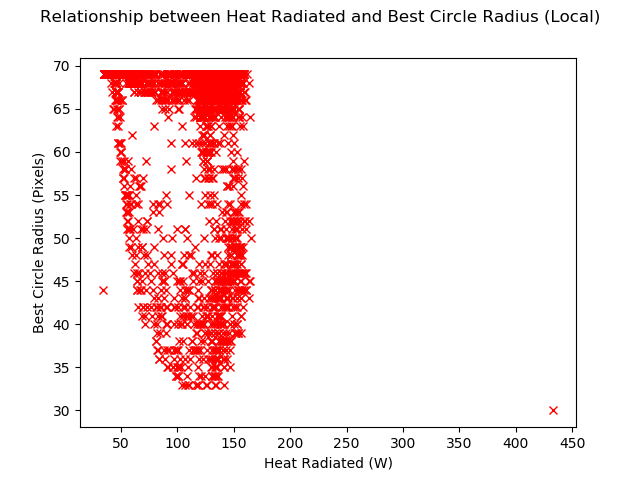

# Fitting Data to Ideal Hough Circle Data

This folder contains scripts which fit functions to a dataset representing the state of a Hough Circle that gives a power estimate closes to 500 W. This data is stored in two files; one for the images being [locally equalized](thermal-hough-circle-metrics-local.csv) and one for [global equalized](thermal-hough-circle-metrics-local.csv).

Unless specified otherwise, the data used is the local equalized set.

The goal is to use the information to predict where the ideal Hough Circle is going to be and its radius. The position information is dependent on the laser setup rather than the laser power and could therefore provide a nearly power independent way of estimating power. As the data is likely to group itself with respect to the lower and higher regions of power, a scaling or shifting factor related to the laser power is likely needed to adjust the spread of data.

## Data

As the Hough Circle data is a set of 1D datasets, the thermal data needs to be converted to 1D in order to be compared against it. The original thermal dataset records the radiated heat density (W/m2) across the scope of the camera. This can be converted to the total radiated heat for the area by summing the values in each frame and multiplying it by the size of the frame in terms of metres squared. This can be calculated by multiplying the area of the image in pixels by square of the pixel pitch of the camera. The pixel pitch is the physical size of the area monitored by each pixel. As each pixel is square in this case, the square of the pixel pitch is used as the area of the pixel.

This heat information is stored in the equalized datasets mentioned earlier.

To read in the datasets it is recommended to use the following method.

```Python

import numpy as np

local_data = np.genfromtxt(path,delimiter=',',dtype=float,names=True)

global_data = np.genfromtxt(path,delimiter=',',dtype=float,names=True)

qr = local_data['Radiated_Heat_Times_Area_W']
x = local_data["Best_Circle_X_Position_Pixels"]
y = local_data["Best_Circle_Y_Position_Pixels"]
r = local_data['Best_Circle_Radius_Pixels']
```

The names keyword means the parsed can be treated as a pseudo-dictionary (it actually uses custom data types. For more information read the Numpy documentation). The subsequent references to specific keys then extracts the datasets. It is recommended you extract the information this way to simplify usage.

The [Replotted](Replotted) folder contains a large set of plots showing the different data sets plotted against each other. Other processed datasets are calculated and used as well such as thermal conductivity, thermal diffusivity and the numerical derivatives of the data. As an example, below is a plot showing the radiated heat for the area and the X position of the centre of the ideal circle.


As you can see, the data is spread over a large area with distinct regions containing more data than others. This behaviour is shared across the plots and makes sense as when the laser is off, the best circle is in the centre while when the laser is on, the possible locations is more varied. As another example, have a look at the plot for radiated heat for the area and the circle radius.



This behaviour has two discinct groups connected by a noise to form a U-shape response.

## Methods
### Filtering

You can clearly see on the right hand side of the example plots a single data point that is outside of the normal data range. This is caused by the second frame of the dataset when there's an unexplained spike in heat in the second frame of the dataset. As this deviates so greatly from the norm, it can be safely filtered from the data without affecting the overall behaviour. This data point can be removed by filtering data that is outside three standard deviations.

Another dataset that can be filtered safely is radius. The radius range used in searching for circles in this data set is 2.5 times the laser radius to 4 times the laser radius (18,70 pixels). The lowest value is based on visual inspection of the laser boundary when the laser is on. The upper boundary is based on the assumption that the data follows gaussian behaviour and 99.7% of the values are within 4 standard deviations of the mean.


By visually inspecting the data we can see that the laser boundary remains within the bounds of the image. Therefore we can safely ignore radii that would take even the largest circle outside of the image. This would be all radii greater than half the width of the image (64 image pixels). When filtered we get the following plot.


### Kernel Density Estimate

As you can see, the data distribution and grouping makes it difficult to fit functions to the data. One possible approach, is to fit a kernel density estimate to model the probable circle state given the input. When a KDE is fitted to the data after being filtered for outliers we get the following plots:

|X Position|
|:-:|
||
|Y Position|
||
|Radius|
||
|Radius, <64.0 pixels|
||

We can see a single distinct area that stands out but it's for low power so we can't get a sense of where it could be for high power values. If we take the natural log of the results we get the following plots that better highlight the two areas we're expecting.

|X Position|
|:-:|
||
|Y Position|
||
|Radius|
||
|Radius, <64.0 pixels|
||

Logarithms highlight the lower values in a range of numbers and have clearly helped show the hidden gradients in the data.

Power is estimated by feeding in the current radiated heat for the area and a range of possible values for the respective value (e.g. range of radii values). The value with the highest probability is then taken as that respective value. Using this method, the following power estimate is achieved.

Another way is to fit a single KDE to both the X and Y position data. This would give the probability of the circle centre being in the specific centre given the radiative heat value. 

### DBSCAN

### Polynomials
