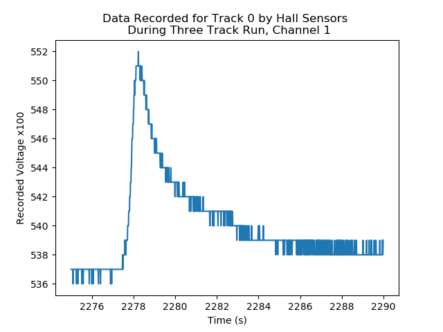
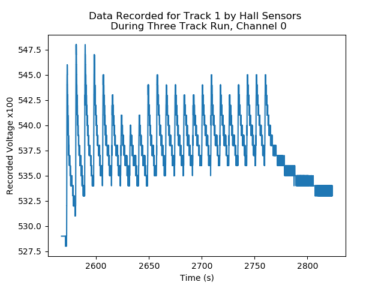

# Hall Sensors

## Requirements
 - Numpy
 - Matplotlib
 - Scipy

## Data Files
 -  : A run with 4 tracks of data. The first one should be ignored as it is not a completed track and was started with too much power.

## Setup

The setup has 6 sensors in total; 5 KY-024 4pin Linear Magnetic Switches Speed Counting Hall Sensor Module in an array and one . The array of sensors is a horizontal array (1x5) sensors with path of the laser going from channel 0 to channel 4. The final sensor is intended to be reference value for the background value. The path of the laser goes from channel 0 to channel 4.

The sensors are recorded using an Arduino Uno, a Tinkerkit Sensor Shield and an Ethernet board. The Tinkerkit shield simplifies the connections between the Arduino and the sensor shield so it can easily be removed or change around. The Ethernet shield is used to hold a SD card to write the data to. The script recording the data is .

The recorded data is the received value from the ADC which appears to be the voltage times 100 (e.g. 5V equated to 500). The data is not processed further as part of the recording.

## Results
### Three Tracks

The Three Tracks dataset contains the recording of three tiny walls being built and one failed attempt. The failed attempt, occuring at the start, was stopped as the laser power was twice the intended amount. The remaining tracks were built at a fixed distance apart from each other and were completed successfully without any serious problems.

During the course of the successful tracks, it was noticed by the technician running the machine that some beading was occuring across the surface and it had a slope at the start of the track and a slight dip at the end. The slope at the start is due to the decoupling between the powder feed and the laser power. The powder feed is turned on before the laser and there is a slight delay between the two to allow the feed rate to stabilise. As a result, there is a pile of powder when the laser is first turned on forming a slope/peak.

Beading is when a series of hills form over the build surface rather than being flat. This isn't always a problem as in more substantial builds, the addition of more material combined with the laser smooths it out creating a satisfactory finish. The exact cause of this during this specific build is unknown.

The data has eight columns in total. The first column is the recorded sampling time from the start of the recording loop. The next five columns are the hall sensors in the row. The next column is the reference signal and the final one is unknown. The reference sensor data is not useful as for some reason the signal wasn't recorded. The final channel is full of NaNs (Not a Number) and can't be processed anyway.

For most of the processing and plotting, the final two columns are ignored. The only time it is plotted is the plot of all the data.

### Plotting

Below is a plot of the entire dataset with each sensor getting it's own line. The final column was not plotted as NaNs cannot be plotted under matplotlib. The scaling is set the way it is as the reference sensor data is all zeros and forces the lower y-axis limit to 0.

Separating the channels we get the following plot

| Channel 0 | Channel 1 | Channel 2 | Channel 3 |
|:---------:|:---------:|:---------:|:---------:|
|||||
| Channel 4 | Channel 5 | Channel 6 | Channel 7 |
||||NOT PLOTTABLE|

If we remove the final two columns we get the following plot. Four distinct groupings of behaviour can be seen clearly and based on the order can be assumed to be belonging to each track starting with the failed one on the left. Each of the channels appears to share similar behaviour with the values rising to some peak values before decaying back to some base level.

If the focus is changed to the individual tracks we get the following plots. Each successful track was built over the course of approximately 25 seconds. The difference in magnitudes between the different sections is quite dramatic considering the short distance between tracks.

#### Track 0

The following plots are the channels for the failed track. Whilst the attempt was stopped early on, similar dynamics are shared across all tracks. The values start off at a some base value and rise to a peak and gradually decay down to a new value.

| Channel 0 | Channel 1 | Channel 2|
|:---------:|:---------:|:--------:|
||||

| Channel 3 | Channel 4 |
|:---------:|:---------:|
|||

This is the first track data plotted as a contour

#### Track 1

The following plots are the channels for the first successful track.

| Channel 0 | Channel 1 | Channel 2|
|:---------:|:---------:|:--------:|
||||

| Channel 3 | Channel 4 |
|:---------:|:---------:|
|||

This is the second track data plotted as a contour

#### Track 2

The following plots are the channels for the second successful track.

| Channel 0 | Channel 1 | Channel 2|
|:---------:|:---------:|:--------:|
||||

| Channel 3 | Channel 4 |
|:---------:|:---------:|
|||

This is the third track data plotted as a contour

#### Track 3

The following plots are the channels for the third successful track.

| Channel 0 | Channel 1 | Channel 2|
|:---------:|:---------:|:--------:|
||||

| Channel 3 | Channel 4 |
|:---------:|:---------:|
|||

This is the fourth track data plotted as a contour

#### Normalizing

There are several way to normalize the data. For the purpose of comparing the offset between the different channels, the best way is to normalize each channel locally by subtracting the channel minimum and dividing by the channel's data range. The result is each channel starts at zero so they can be overlayed ontop of eachother.

### Conclusions

