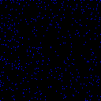
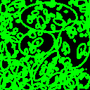
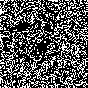

# Estimating Power using Hough Circles

Using the model developed [here](../ModelApi), the radiative heat recorded by the top-down thermal camera can be converted to laser power density. The power density represents the amount of laser energy required to raise the temperature from one frame to the next. In order to estimate the laser power being applied, the bounary of the heating area needs to be found. This involves deploying an algorithm that can robustly find the edges of the shape.

The folder is focussed on the investigation into using the Hough Ellipse algorithm to estimate the area.

## Requirements
  - OpenCV (base)
  - Skimage
  - Thermal Model API ([here](../ModelApi))
  - Numpy
  
## Algorithm

Using the developed thermal camera model, the thermal camera footage is converted from radiative heat to laser power density. The data is normalised to the global limits of the dataset and rescaled to the range 0 to 255 as an 8-bit image so it can be processed by OpenCV and skimage. The normalized PD images are then processed using a combination of OpenCV''s implementation of the Sobel edge detector followed by the same library's implementation of the Canny edge detector with the threshold range set as the mean Sobel value and twice the Sobel value. The Canny edge detector binarises the image allowing contours to be found hopefully corresponding to the boundary of the laser. If contours were found, an ellipse is fitted to each one and are then evaluated.

An appropriate evaluation algorithm was never developed as Hough's Ellipse algorithm proved to be too slow to be realistically employed in a fast setting and it was outside the perview of the project to optimize the algorithm.

At present, the script [houghellipsepest](houghellipsepest.py) finds and fits ellipses to each of the contours found in the processed power density images. Both the results of edge detection, contour detection and fitted ellipses are saved as images.

Below are examples of the contours, ellipses and sobel results.

  
