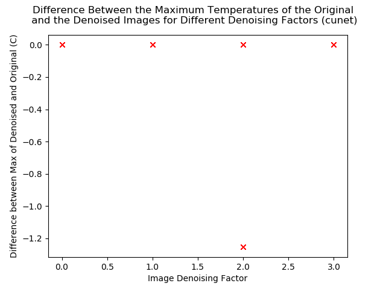
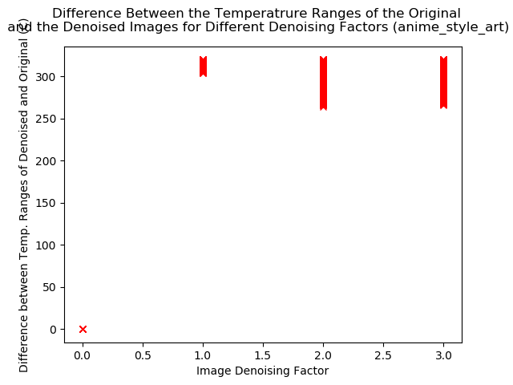
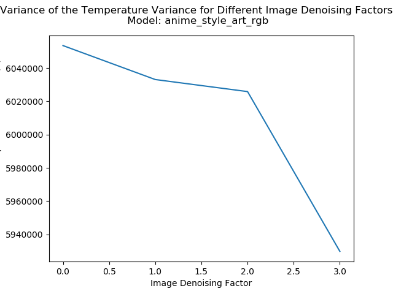

## Results

As the complete results are over 20GB in size, a single frame has been selected to represent the impact of different models and scaling factors. Frame 1048 was selected as it shows the author displaying several fingers which can be viewed as an image with several distinct features.

Below is the reference image in the different data types colormapped to make it a bit easier to see.

| **uint8** | **uint16** | **float32** | **float64** |
|:---------:|:---------:|:---------:|:---------:|
|||||

A few differences can already be seen with the different data types. Under this colormap, the darker blue indicates a lower temperature and black the hottest. When the 8-bit reference image is compared to the 16-bit, we can see that the 16-bit has a greater range of lower temperatures indicated with the blue colors. As expected, the 16-bit image has a richer range of colors. The floating point images are showing similar behaviour with the range of range of blue colors it displays. Interestingly, it's displaying higher temperatures in the palm area compared to the other data types.

The author notes that these values are of course affected by the number of levels used in the colormap and any data truncation caused when the image was read in.

When the program was executed, a large number of error messages were displayed indicating that the denoised versions of the 32-bit floating point images could not be read back in citing an inability to decode the bytes. This suggests that when Waifu2x denoises the images and attempts to "fill in" the missing areas, it somehow generates or corrupts the data. To handle this without stopping the program, the metrics are all left as their default values of 0. This behaviour did not apply to 64-bit floating point images.

### Minimum Values
#### uint8
##### Minimum Value
###### Difference
|**anime style art**|**anime style art RGB**|
|:-:|:-:|
|||
|**CUNet**|**Photo**|
|||
|**UKBench**|**Upconv 7 anime style art RGB**|
|||
|**UpConv 7 Photo**|**Up ResNet 10**|
||

###### Variance
|**anime style art**|**anime style art RGB**|
|:-:|:-:|
|||
|**CUNet**|**Photo**|
|||
|**UKBench**|**Upconv 7 anime style art RGB**|
|||
|**UpConv 7 Photo**|**Up ResNet 10**|
||

##### Maximum Value
###### Difference
|**anime style art**|**anime style art RGB**|
|:-:|:-:|
|||
|**CUNet**|**Photo**|
|||
|**UKBench**|**Upconv 7 anime style art RGB**|
|||
|**UpConv 7 Photo**|**Up ResNet 10**|
||

###### Variance
|**anime style art**|**anime style art RGB**|
|:-:|:-:|
|||
|**CUNet**|**Photo**|
|||
|**UKBench**|**Upconv 7 anime style art RGB**|
|||
|**UpConv 7 Photo**|**Up ResNet 10**|
||

##### Variance
###### Difference
|**anime style art**|**anime style art RGB**|
|:-:|:-:|
|||
|**CUNet**|**Photo**|
|||
|**UKBench**|**Upconv 7 anime style art RGB**|
|||
|**UpConv 7 Photo**|**Up ResNet 10**|
||

###### Variance
|**anime style art**|**anime style art RGB**|
|:-:|:-:|
|||
|**CUNet**|**Photo**|
|||
|**UKBench**|**Upconv 7 anime style art RGB**|
|||
|**UpConv 7 Photo**|**Up ResNet 10**|
||

##### Temperature Range
###### Difference
|**anime style art**|**anime style art RGB**|
|:-:|:-:|
|||
|**CUNet**|**Photo**|
|||
|**UKBench**|**Upconv 7 anime style art RGB**|
|||
|**UpConv 7 Photo**|**Up ResNet 10**|
||

###### Variance
|**anime style art**|**anime style art RGB**|
|:-:|:-:|
|||
|**CUNet**|**Photo**|
|||
|**UKBench**|**Upconv 7 anime style art RGB**|
|||
|**UpConv 7 Photo**|**Up ResNet 10**|
||

#### uint16
##### Minimum Value
###### Difference
|**anime style art**|**anime style art RGB**|
|:-:|:-:|
|||
|**CUNet**|**Photo**|
|||
|**UKBench**|**Upconv 7 anime style art RGB**|
|||
|**UpConv 7 Photo**|**Up ResNet 10**|
||

###### Variance
|**anime style art**|**anime style art RGB**|
|:-:|:-:|
|||
|**CUNet**|**Photo**|
|||
|**UKBench**|**Upconv 7 anime style art RGB**|
|||
|**UpConv 7 Photo**|**Up ResNet 10**|
||

##### Maximum Value
###### Difference
|**anime style art**|**anime style art RGB**|
|:-:|:-:|
|||
|**CUNet**|**Photo**|
|||
|**UKBench**|**Upconv 7 anime style art RGB**|
|||
|**UpConv 7 Photo**|**Up ResNet 10**|
||

###### Variance
|**anime style art**|**anime style art RGB**|
|:-:|:-:|
|||
|**CUNet**|**Photo**|
|||
|**UKBench**|**Upconv 7 anime style art RGB**|
|||
|**UpConv 7 Photo**|**Up ResNet 10**|
||

##### Variance
###### Difference
|**anime style art**|**anime style art RGB**|
|:-:|:-:|
|||
|**CUNet**|**Photo**|
|||
|**UKBench**|**Upconv 7 anime style art RGB**|
|||
|**UpConv 7 Photo**|**Up ResNet 10**|
||

###### Variance
|**anime style art**|**anime style art RGB**|
|:-:|:-:|
|||
|**CUNet**|**Photo**|
|||
|**UKBench**|**Upconv 7 anime style art RGB**|
|||
|**UpConv 7 Photo**|**Up ResNet 10**|
||

##### Temperature Range
###### Difference
|**anime style art**|**anime style art RGB**|
|:-:|:-:|
|||
|**CUNet**|**Photo**|
|||
|**UKBench**|**Upconv 7 anime style art RGB**|
|||
|**UpConv 7 Photo**|**Up ResNet 10**|
||

###### Variance
|**anime style art**|**anime style art RGB**|
|:-:|:-:|
|||
|**CUNet**|**Photo**|
|||
|**UKBench**|**Upconv 7 anime style art RGB**|
|||
|**UpConv 7 Photo**|**Up ResNet 10**|
||

#### float64
##### Minimum Value
###### Difference
|**anime style art**|**anime style art RGB**|
|:-:|:-:|
|||
|**CUNet**|**Photo**|
|||
|**UKBench**|**Upconv 7 anime style art RGB**|
|||
|**UpConv 7 Photo**|**Up ResNet 10**|
||

###### Variance
|**anime style art**|**anime style art RGB**|
|:-:|:-:|
|||
|**CUNet**|**Photo**|
|||
|**UKBench**|**Upconv 7 anime style art RGB**|
|||
|**UpConv 7 Photo**|**Up ResNet 10**|
||

##### Maximum Value
###### Difference
|**anime style art**|**anime style art RGB**|
|:-:|:-:|
|||
|**CUNet**|**Photo**|
|||
|**UKBench**|**Upconv 7 anime style art RGB**|
|||
|**UpConv 7 Photo**|**Up ResNet 10**|
||

###### Variance
|**anime style art**|**anime style art RGB**|
|:-:|:-:|
|||
|**CUNet**|**Photo**|
|||
|**UKBench**|**Upconv 7 anime style art RGB**|
|||
|**UpConv 7 Photo**|**Up ResNet 10**|
||

##### Variance
###### Difference
|**anime style art**|**anime style art RGB**|
|:-:|:-:|
|||
|**CUNet**|**Photo**|
|||
|**UKBench**|**Upconv 7 anime style art RGB**|
|||
|**UpConv 7 Photo**|**Up ResNet 10**|
||

###### Variance
|**anime style art**|**anime style art RGB**|
|:-:|:-:|
|||
|**CUNet**|**Photo**|
|||
|**UKBench**|**Upconv 7 anime style art RGB**|
|||
|**UpConv 7 Photo**|**Up ResNet 10**|
||

##### Temperature Range
###### Difference
|**anime style art**|**anime style art RGB**|
|:-:|:-:|
|||
|**CUNet**|**Photo**|
|||
|**UKBench**|**Upconv 7 anime style art RGB**|
|||
|**UpConv 7 Photo**|**Up ResNet 10**|
||

###### Variance
|**anime style art**|**anime style art RGB**|
|:-:|:-:|
|||
|**CUNet**|**Photo**|
|||
|**UKBench**|**Upconv 7 anime style art RGB**|
|||
|**UpConv 7 Photo**|**Up ResNet 10**|
||

### denoised Images

Under the folder [Contours](./Contours) are a series of colormapped images showing the results of scaling frame 1048 using different models and scaling factors. As there are a lot of images, only the results using scaling factor 10 are shown in this documents. It is up to to the user if they want to compare the whole set.

<table>
    <thead>
        <tr>
            <th>uint8</th>
            <th>uint16</th>
            <th>float32</th>
        </tr>
    </thead>
    <tbody>
        <tr>
            <td align="center" colspan=3>Original</td>
        </tr>
        <tr>
            <td align="center">
            <td align="center">
            <td align="center">
        </tr>
        <tr>
            <td align="center" colspan=3>Anime Style</td>
        </tr>
        <tr>
            <td align="center">
            <td align="center">
            <td align="center">
        </tr>
        <tr>
            <td align="center" colspan=3>Anime Style RGB</td>
        </tr>
        <tr>
            <td align="center">
            <td align="center">
            <td align="center">
        </tr>
        <tr>
            <td align="center" colspan=3>CUNet</td>
        </tr>
        <tr>
            <td align="center">
            <td align="center">
            <td align="center">
        </tr>
        <tr>
            <td align="center" colspan=3>Photo</td>
        </tr>
        <tr>
            <td align="center">
            <td align="center">
            <td align="center">
        </tr>
        <tr>
            <td align="center" colspan=3>UKBench</td>
        </tr>
        <tr>
            <td align="center" colspan=3>UpConv7 Anime Style Art RGB</td>
        </tr>
        <tr>
            <td align="center">
            <td align="center">
            <td align="center">
        </tr>
        <tr>
            <td align="center" colspan=3>UpConv7 Photo</td>
        </tr>
        <tr>
            <td align="center">
            <td align="center">
            <td align="center">
        </tr>
        <tr>
            <td align="center" colspan=3>UpResNet10</td>
        </tr>
        <tr>
            <td align="center">
            <td align="center">
            <td align="center">
        </tr> 
    </tbody>
</table>
