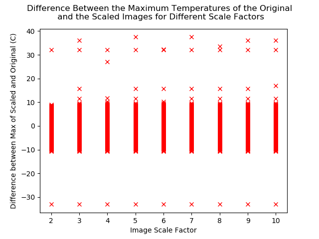
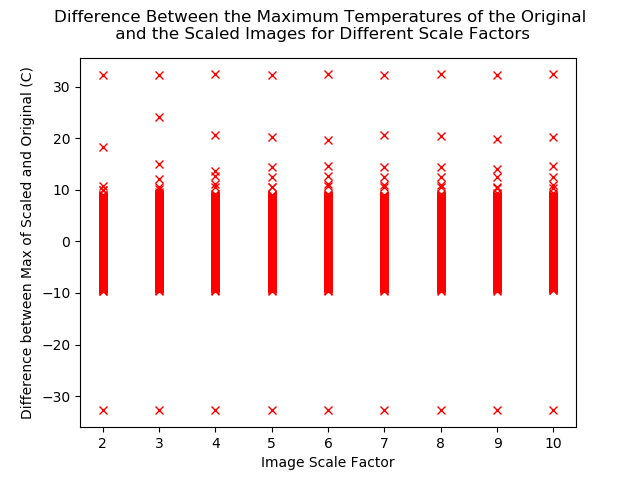
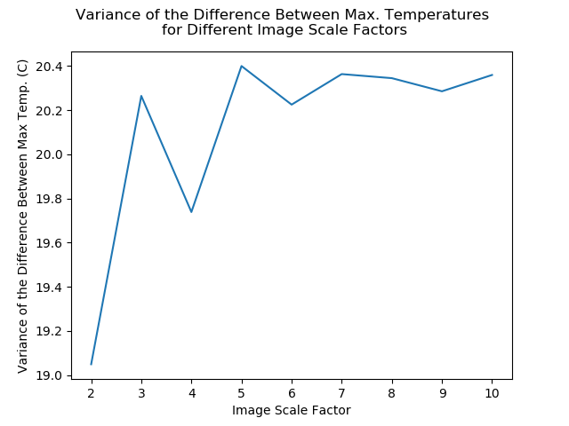
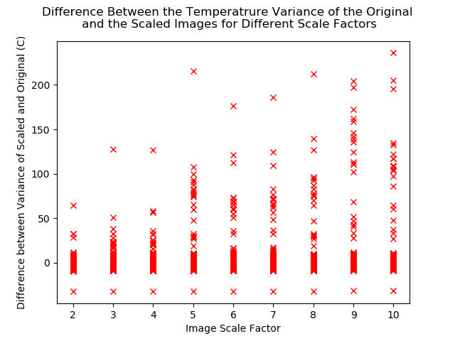
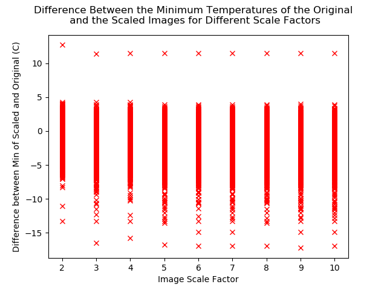
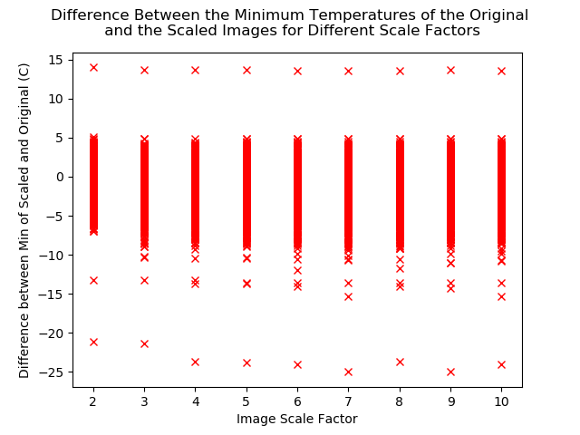

# Scaling the Images from the Raspberry Pi

The inexpensive thermal camera attached to the Raspberry Pi records images at a resolution of 32x24 pixels which when compared to the BEAM camera of 128x128 pixels is very small.
[Waifu2x](https://github.com/nagadomi/waifu2x) is a Deep Convolutional Neural Network designed to scale and/or denoise anime-style images and other photos. The idea of this script is to try a range of different models and scaling sizes on a set of recorded data and quantify the impact it has on the temperature values. The hope is that the raspberry pi footage can be scaled effectively, with minimal impact to the temperature values, and achieve a similar pixel pitch to the BEAM camera.

## Requirements
 - Numpy
 - h5py
 - [waifu-caffe](https://github.com/lltcggie/waifu2x-caffe)
 - Matplotlib (can be swapped out for a different plotting library)
 
## Scripts
**callwaifu.py**
 - Reads in a HDF5 file with a hard coded path and tries every model in the waifu2x-caffe models folder with a range of scaling factors from 2-10 and image data types.
 - Saves the source data in the different data types and references those images throughout the rest of the program.
 - Calls waifu2x-caffe-cui.exe with GPU options enabled.
 - The metrics recorded for each model and data type is saved to separate CSVs
 - **WARNINGS**
     o This program takes several hours to run
     o If you are saving the results to GitHub or similar service, it is recommended to compress the log file and only upload a select number of the images rather than all of them.
     o Produced +20GB of results.
 - Generates a timestamped log file of what happens during the run.

**callwaifudenoise.py**
 - Reads in a HDF5 file with a hard coded path and tries every model in the waifu2x-caffe models folder with a range of denosing factors from 0-3 and image data types.
 - Saves the source data in the different data types and references those images throughout the rest of the program.
 - Calls waifu2x-caffe-cui.exe with GPU options enabled.
 - The metrics recorded for each model and data type is saved to separate CSVs
 - **WARNINGS**
     o This program takes several hours to run
     o If you are saving the results to GitHub or similar service, it is recommended to compress the log file and only upload a select number of the images rather than all of them.
     o Produces +20GB of results.
 - Generates a timestamped log file of what happens during the run.
     
**copyrenameegimages.py**
 - Iterates through the ScaledResults folder of a callwaifu.py and copies and renames the files so a separate folder.
 - Files are renamed as <model>-<datatype>-<original filename>.png
 - The images are written to a folder called ExampleImages that is created by the program
 - Iterates through the images saved to ExampleImages, applies a colormap called Jet and saves the results to a folder called Contours.
 - Iterates through a separately created folder called OriginalSaves, applies a colormap called Jet and saves the results in a folder called ContourBase. This is designed to be directed at the folder of the original reference images so it can be compared to the color mapped versions of the scaled result.

## Data
**pi-camera-data-192168146-2019-09-05T10-45-18.hdf5**
  - 24x32, 32 FPS, 60s,~1800 frames of footage recorded using the Raspberry Pi thermal camera

**arrowshape-temperature-HDF5.hdf5**
  - 128x128, est 64 FPS, ~19000 frames of footage recorded using BEAM's camera
  
## Waifu2x

## Data Used

pi-camera-data-192168146-2019-09-05T10-45-18.hdf5 is 60 seconds of 32 FPS footage of the author performing various hand gestures in front of the camera.

## Process

Waifu2x-caffe has been trained a number of different ways and comes with many model files. The models are named as follows.
 - anime_style_art
 - anime_style_art_rgb
 - cunet
 - photo
 - ukbench
 - upconv_7_anime_style_art_rgb
 - upconv_7_photo
 - upresnet10
 
The program iterates through each model performing the following process and recording the results.

First the temperature data is normalized according to the known temperature limits from the thermal camera specification. The values are then scaled according to the target image data type (e.g. 8-bit, 0-255). Different image data types are investigated as different type have data ranges and resolutions and will therefore impact the quality of the result. As the thermal camera in this case has a temperature resolution of 1 degree Celcius, it might turn out that an integer data type performs the same way as a float data type. The data types tried are as follows.

 - uint8
 - uint16
 - float32
 - float64
 
The integer data types are saved as PNGs while the float data types are saved as TIF images. Each image data type is saved into its own folder.

**(dataset name)/DatasetImages/(data type name)**

The waifu2x-caffe executable is then called with different scaling factors and passing it the path to where the images are stored. The output folder for the scaled images is generated by the executable and is named according to the following format:

**(dataset name)/ScaledResults/(model name)/(data type name)/(scale factor as integer)/pi-camera-f(frame number)**
 
After the range of scaling factors have been applied, the images are then read back in and rescaled to the temperature limits of the camera. The scaled frame is then compared against the original frame and the following metrics are analysed:

 - Difference between maximum temperatures
 - Difference between minimum temperatures
 - Difference between temperature variance
 - Variance in the difference between maximum temperatures
 - Variance in the difference between minimum temperatures
 - Variance in the difference between temperature variances
 
The plots generated are stored in the following location.

**(dataset name)/Plots/(model name)/(data type)/(plot name).png

All plots and folders are created by the program so there's no need for the user to create them.

For each model and data dtype, the scaling factor that results in the smallest variance of each parameter is saved to a text file. The text files are stored at.

**(dataset name)/Plots/(model name)/(data type name)/best-scale-(data type name).txt***

A timestamped log of all the activities performed is also kept by the program and prints the total runtime at the end. The log is saved to the current working directory and is called superlog-(datasetname).txt.

## Folder Structure

To summarise, the folder structure generated by the program is as follows.

- Name of dataset file without extension

  o DatasetImages : Temperature information stored in the dataset converted to images
    * uint8 : 8-bit unsigned integer images
    * uint16 : 16-bit unsigned integer images
    * float32 : 32-bit floating point images
    * float64 : 64-bit floating point images
    
  o ScaledResults : Results of scaling the images using different models and data types
    + (model name)
    + uint8 : 8-bit unsigned integer images
    + uint16 : 16-bit unsigned integer images
    + float32 : 32-bit floating point images
    + float64 : 64-bit floating point images
    
  o Plots : Plots of the analytics for the different models and data types
    + (model name)
    + uint8 : 8-bit unsigned integer images
    + uint16 : 16-bit unsigned integer images
    + float32 : 32-bit floating point images
    + float64 : 64-bit floating point images

## Analysis

In an ideal case, original data and the scaled data will have the same maximum temperature, minimum temperature and variance in temperature. All the scaling should do is add more detail to the temperature data.

Of course this isn't the case. Data is lost due to the normalizing, the scaling network and data loss from saving the image. What needs to be found is at what scale factor the data becomes too degraded.

In theory the impact on the temperature values should be fairly minimal as the temperature resolution of the Raspberry Pi camera is 1 degree C so converting there's isn't as much precision to lose.

The metrics recorded were chosen because they look at the difference the two frames even though they are two different sizes.

## Results

As the complete results are over 20GB in size, a single frame has been selected to represent the impact of different models and scaling factors. Frame 430 was selected as it shows the author displaying several fingers which can be viewed as an image with several distinct features.

Below is the reference image in the different data types colormapped to make it a bit easier to see.

| **uint8** | **uint16** | **float32** | **float64** |
|:---------:|:---------:|:---------:|:---------:|
|||||

A few differences can already be seen with the different data types. Under this colormap, the darker blue indicates a lower temperature and black the hottest. When the 8-bit reference image is compared to the 16-bit, we can see that the 16-bit has a greater range of lower temperatures indicated with the blue colors. As expected, the 16-bit image has a richer range of colors. The floating point images are showing similar behaviour with the range of range of blue colors it displays. Interestingly, it's displaying higher temperatures in the palm area compared to the other data types.

The author notes that these values are of course affected by the number of levels used in the colormap and any data truncation caused when the image was read in.

When the program was executed, a large number of error messages were displayed indicating that the scaled versions of the 32-bit floating point images could not be read back in citing an inability to decode the bytes. This suggests that when Waifu2x scales the images and attempts to "fill in" the missing areas, it somehow generates or corrupts the data. To handle this without stopping the program, the metrics are all left as their default values of 0. This behaviour did not apply to 64-bit floating point images.

### Minimum Values
#### uint8
##### Minimum Value
###### Difference
|**anime style art**|**anime style art RGB**|
|:-:|:-:|
|||
|**CUNet**|**Photo**|
|||
|**UKBench**|**Upconv 7 anime style art RGB**|
|||
|**UpConv 7 Photo**|**Up ResNet 10**|
||

###### Variance
|**anime style art**|**anime style art RGB**|
|:-:|:-:|
|||
|**CUNet**|**Photo**|
|||
|**UKBench**|**Upconv 7 anime style art RGB**|
|||
|**UpConv 7 Photo**|**Up ResNet 10**|
||

##### Maximum Value
###### Difference
|**anime style art**|**anime style art RGB**|
|:-:|:-:|
|||
|**CUNet**|**Photo**|
|||
|**UKBench**|**Upconv 7 anime style art RGB**|
|||
|**UpConv 7 Photo**|**Up ResNet 10**|
||

###### Variance
|**anime style art**|**anime style art RGB**|
|:-:|:-:|
|||
|**CUNet**|**Photo**|
|||
|**UKBench**|**Upconv 7 anime style art RGB**|
|||
|**UpConv 7 Photo**|**Up ResNet 10**|
||

##### Variance
###### Difference
|**anime style art**|**anime style art RGB**|
|:-:|:-:|
|||
|**CUNet**|**Photo**|
|||
|**UKBench**|**Upconv 7 anime style art RGB**|
|||
|**UpConv 7 Photo**|**Up ResNet 10**|
||

###### Variance
|**anime style art**|**anime style art RGB**|
|:-:|:-:|
|||
|**CUNet**|**Photo**|
|||
|**UKBench**|**Upconv 7 anime style art RGB**|
|||
|**UpConv 7 Photo**|**Up ResNet 10**|
||

##### Temperature Range
###### Difference
|**anime style art**|**anime style art RGB**|
|:-:|:-:|
|||
|**CUNet**|**Photo**|
|||
|**UKBench**|**Upconv 7 anime style art RGB**|
|||
|**UpConv 7 Photo**|**Up ResNet 10**|
||

###### Variance
|**anime style art**|**anime style art RGB**|
|:-:|:-:|
|||
|**CUNet**|**Photo**|
|||
|**UKBench**|**Upconv 7 anime style art RGB**|
|||
|**UpConv 7 Photo**|**Up ResNet 10**|
||

#### uint16
##### Minimum Value
###### Difference
|**anime style art**|**anime style art RGB**|
|:-:|:-:|
|||
|**CUNet**|**Photo**|
|||
|**UKBench**|**Upconv 7 anime style art RGB**|
|||
|**UpConv 7 Photo**|**Up ResNet 10**|
||

###### Variance
|**anime style art**|**anime style art RGB**|
|:-:|:-:|
|||
|**CUNet**|**Photo**|
|||
|**UKBench**|**Upconv 7 anime style art RGB**|
|||
|**UpConv 7 Photo**|**Up ResNet 10**|
||

##### Maximum Value
###### Difference
|**anime style art**|**anime style art RGB**|
|:-:|:-:|
|||
|**CUNet**|**Photo**|
|||
|**UKBench**|**Upconv 7 anime style art RGB**|
|||
|**UpConv 7 Photo**|**Up ResNet 10**|
||

###### Variance
|**anime style art**|**anime style art RGB**|
|:-:|:-:|
|||
|**CUNet**|**Photo**|
|||
|**UKBench**|**Upconv 7 anime style art RGB**|
|||
|**UpConv 7 Photo**|**Up ResNet 10**|
||

##### Variance
###### Difference
|**anime style art**|**anime style art RGB**|
|:-:|:-:|
|||
|**CUNet**|**Photo**|
|||
|**UKBench**|**Upconv 7 anime style art RGB**|
|||
|**UpConv 7 Photo**|**Up ResNet 10**|
||

###### Variance
|**anime style art**|**anime style art RGB**|
|:-:|:-:|
|||
|**CUNet**|**Photo**|
|||
|**UKBench**|**Upconv 7 anime style art RGB**|
|||
|**UpConv 7 Photo**|**Up ResNet 10**|
||

##### Temperature Range
###### Difference
|**anime style art**|**anime style art RGB**|
|:-:|:-:|
|||
|**CUNet**|**Photo**|
|||
|**UKBench**|**Upconv 7 anime style art RGB**|
|||
|**UpConv 7 Photo**|**Up ResNet 10**|
||

###### Variance
|**anime style art**|**anime style art RGB**|
|:-:|:-:|
|||
|**CUNet**|**Photo**|
|||
|**UKBench**|**Upconv 7 anime style art RGB**|
|||
|**UpConv 7 Photo**|**Up ResNet 10**|
||

#### float64
##### Minimum Value
###### Difference
|**anime style art**|**anime style art RGB**|
|:-:|:-:|
|||
|**CUNet**|**Photo**|
|||
|**UKBench**|**Upconv 7 anime style art RGB**|
|||
|**UpConv 7 Photo**|**Up ResNet 10**|
||

###### Variance
|**anime style art**|**anime style art RGB**|
|:-:|:-:|
|||
|**CUNet**|**Photo**|
|||
|**UKBench**|**Upconv 7 anime style art RGB**|
|||
|**UpConv 7 Photo**|**Up ResNet 10**|
||

##### Maximum Value
###### Difference
|**anime style art**|**anime style art RGB**|
|:-:|:-:|
|||
|**CUNet**|**Photo**|
|||
|**UKBench**|**Upconv 7 anime style art RGB**|
|||
|**UpConv 7 Photo**|**Up ResNet 10**|
||

###### Variance
|**anime style art**|**anime style art RGB**|
|:-:|:-:|
|||
|**CUNet**|**Photo**|
|||
|**UKBench**|**Upconv 7 anime style art RGB**|
|||
|**UpConv 7 Photo**|**Up ResNet 10**|
||

##### Variance
###### Difference
|**anime style art**|**anime style art RGB**|
|:-:|:-:|
|||
|**CUNet**|**Photo**|
|||
|**UKBench**|**Upconv 7 anime style art RGB**|
|||
|**UpConv 7 Photo**|**Up ResNet 10**|
||

###### Variance
|**anime style art**|**anime style art RGB**|
|:-:|:-:|
|||
|**CUNet**|**Photo**|
|||
|**UKBench**|**Upconv 7 anime style art RGB**|
|||
|**UpConv 7 Photo**|**Up ResNet 10**|
||

##### Temperature Range
###### Difference
|**anime style art**|**anime style art RGB**|
|:-:|:-:|
|||
|**CUNet**|**Photo**|
|||
|**UKBench**|**Upconv 7 anime style art RGB**|
|||
|**UpConv 7 Photo**|**Up ResNet 10**|
||

###### Variance
|**anime style art**|**anime style art RGB**|
|:-:|:-:|
|||
|**CUNet**|**Photo**|
|||
|**UKBench**|**Upconv 7 anime style art RGB**|
|||
|**UpConv 7 Photo**|**Up ResNet 10**|
||

### Scaled Images

Under the folder [Contours](./Contours) are a series of colormapped images showing the results of scaling frame 430 using different models and scaling factors. As there are a lot of images, only the results using scaling factor 10 are shown in this documents. It is up to to the user if they want to compare the whole set.

<table>
    <thead>
        <tr>
            <th>uint8</th>
            <th>uint16</th>
            <th>float32</th>
        </tr>
    </thead>
    <tbody>
        <tr>
            <td align="center" colspan=3>Original</td>
        </tr>
        <tr>
            <td align="center">
            <td align="center">
            <td align="center">
        </tr>
        <tr>
            <td align="center" colspan=3>Anime Style</td>
        </tr>
        <tr>
            <td align="center">
            <td align="center">
            <td align="center">
        </tr>
        <tr>
            <td align="center" colspan=3>Anime Style RGB</td>
        </tr>
        <tr>
            <td align="center">
            <td align="center">
            <td align="center">
        </tr>
        <tr>
            <td align="center" colspan=3>CUNet</td>
        </tr>
        <tr>
            <td align="center">
            <td align="center">
            <td align="center">
        </tr>
        <tr>
            <td align="center" colspan=3>Photo</td>
        </tr>
        <tr>
            <td align="center">
            <td align="center">
            <td align="center">
        </tr>
        <tr>
            <td align="center" colspan=3>UKBench</td>
        </tr>
        <tr>
            <td align="center">
            <td align="center">
            <td align="center">
        </tr>
        <tr>
            <td align="center" colspan=3>UpConv7 Anime Style Art RGB</td>
        </tr>
        <tr>
            <td align="center">
            <td align="center">
            <td align="center">
        </tr>
        <tr>
            <td align="center" colspan=3>UpConv7 Photo</td>
        </tr>
        <tr>
            <td align="center">
            <td align="center">
            <td align="center">
        </tr>
        <tr>
            <td align="center" colspan=3>UpResNet10</td>
        </tr>
        <tr>
            <td align="center">
            <td align="center">
            <td align="center">
        </tr> 
    </tbody>
</table>
