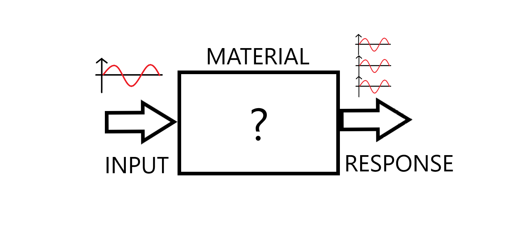
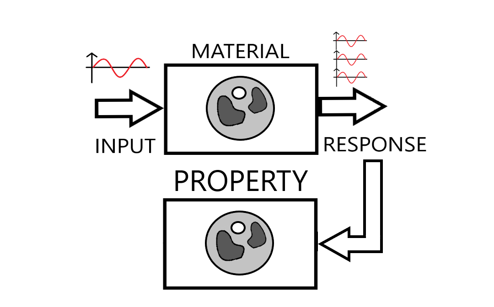

# Magnetic and Electrical Tomography

The goal of magnetic topography is to generate an electromagnetic field that passes through an object or area of interest, induces an eddy current and record the resulting electromagnetic field on a receiver coil. This return signl can be measured absolutely or be observed as a change in the signal exciting the return coil. The return signal can be used to infer the magnetic properties across the target area and volume.  For the rest of this description, it is assumed that related technqiues will be used to investigate objects or materials within the sensor area. These methods can in theory be used to investigate any material with electrically conductive properties including biological materials and carbon fibre.

The induction and receiver coils are equispaced in a ring around the target sensor area. As mentioned, the coils are treated as excitor-receiver pairs but the actual choice of which coils to use is up to the developer. For example neighbouring pairs could be used, opposing pairs or something more custom such as a star arrangement.

A close relative of MIT is Electrical Impedance Tomography (EIT) which instead introduces a small current into the object and records the response through surface measurements. The measurements taken can be used to infer the material's conductivity and permittivity across the object's volume. This class of methods is typically used with biological tissue as a low cost alternative to CatScan (CT) and Magnetic Resonance Imaging (MRI).

The distribution of the material's properties aross the volume can be used to identify flaws such as cracks and defects. There have been a number of industrial projects interested in using EIT for non-invasive testing and investigation.

In both cases there are examples of projects where a 3d rendering of the object's properties has been generated.

The [papers](https://github.com/ManufacturingInformatics/PitchIn-LBAM/tree/dev/01%20Input/from%20UoS/Papers/MagneticTomography) folder contains a number of articles on the theory and example applications.

## Noteable Papers and Projects
This section describes noteworthy projects and papers whose investigations using these techniques have created excellent results or noteable improvements over existing methods.

### Spectra and Mind's Eye Biomedical

Spectra is an open-source hardware and software biomedical imaging platfotm. It uses EIT to investigate materials placed within it's sensor. A custom PCB platform and sensor rig has been [created](https://mindseyebiomedical.com/) and the software is available publically on [Github](https://github.com/OpenEIT/OpenEIT). It has 32 electrodes monitoring an area of several centimetres in radius (can't find an exact size yet).

It has been described as running in realtime with 8 electrodes but still very quickly with all 32 electrodes in use. The software library provides a GUI and the tools to process the live data and rapidly build a matrix of the conductivity values. The hardware platform is a custom PCB boasting bluetooth, 16-bit resolution and 160 kSPS sample rate.

### Theoretical and Experimental Evaluation of Rotational Induction Tomography, UoS Bath, H S Wei et al [link](https://github.com/ManufacturingInformatics/PitchIn-LBAM/tree/dev/01%20Input/from%20UoS/Papers/MagneticTomography/theoretical-and-experimental-evaluation-of-rotational-magnetic-induction-tomography.pdf)

In this paper, Wei et al propose an extension to the traditional stationary arrangement whereby the coils' position is rotated over the course of a measurement cycle. One of the problems with a stationary coil arrangement is the limitation it imposes on resolution of the conductivity array. By rotating it, it effectively introduces a more measurements across the area creating a higher resolution measurement set. In addition to the improvements to methodology, what makes this paper noteworth is the use of OTS (Off the Shelf) components rather than custom built PCBs (Printed Circuit Boards) which is important given the time constraints on this portion of the project.

### Hardware and Software Design for a National Instrument-based magnetic induction tomography system for prospective medical applications, UoS Bath, Wei et al,[link](https://github.com/ManufacturingInformatics/PitchIn-LBAM/tree/dev/01%20Input/from%20UoS/Papers/MagneticTomography/hardware-and-software-design-for-a-NI-based-MIT-system-for-prospective-biomedical-applications.pdf)

This papers describes the complete process of designing and selecting OTS hardware to perform MIT operations. They select a National Instruments (NI) based platform to handle the data aquisition and DAC/ADC conversations. The platform contains a programmable FPGA module allowing developers direct access to the memory enabling high speed streaming.

### PyEIT, [link](https://github.com/liubenyuan/pyEIT)

Python is an open-source library containing solvers and visualization tools for processing EIT data. The library is implemented purely in Python and contains a number of visualization tools such as generating 2D and 3D meshes. This library forms the backbone of the OpenEIT library powering the Spectra platform. This library was initially published by Liu et al in 2018. A copy of the paper outlining it can be found [here](https://github.com/ManufacturingInformatics/PitchIn-LBAM/tree/dev/01%20Input/from%20UoS/Papers/MagneticTomography/pyiet-python-based-framework-for-eit.pdf).

# Principles

## Data Processing

Irrespective of the methodology, the base principle is to introduce a signal to the system, record the responses and use that to infer the structure and target property of the material. The act of processing the data can be broken into two parts; the forward and inverse problem.

### Forward Problem

The forward problem is using the data recorded and the input signal to predict the distribution of the signal through the system. This gives us an idea of the "hot zones" or problem areas where the signal has trouble going through. This provides us with an idea of the shape of the material and it's different areas e.g. the different organs within a body or the different bones within the arms. Without knowing any properties about the material we can infer structural characteristics about it.

#### Forward Solvers

### Inverse Problem

The inverse problem is taking the information we know have about the material and combining it with the other information to predict the distribution of a certain property across the target area. This can be resistance, impedance, conductance or some other property than can be calculated from the signals.

## Excitation Schemes

The choice of which coils to power and which to record greatly affects the predictions as it affects how we're exciting the material and the path the magnetic energy takes.

 *Chapter 26*

### Cross Mode

### Neighbouring Mode

### Opposite Mode

### Adaptive Mode

### Custom Design

Using the script , new excitation paths can be designed, exported and used when simulating the system. Users draw paths on the window to connect a transmitter and receiver coil to each other. These collections of paths define the order in which the coils are excited. This order can be exported to a file and read in through another program. More information can be found .

## Project Hardware Design

A Raspberry Pi v3 or v4 is going to be used as it can run python and potentially the pyEIT for data processing. At the very least it provides greater flexibility with regards to data processing and data storage.

The excitiation signal will be provided via the Pi's audio jack. While it is not the greatest in terms of audio quality, it provides an easier interface for supplying sinusoidial signals.

A multiplexer is required to switch the signal to different coils. A digital signal from the GPIO will control which coil is being affected.

There are also boards like [this](https://shop.pimoroni.com/products/sparkfun-analog-digital-mux-breakout-cd74hc4067?variant=7544220801&currency=GBP&utm_source=google&utm_medium=cpc&utm_campaign=google+shopping&gclid=Cj0KCQiA04XxBRD5ARIsAGFygj9I4uydVPtUSdi53GLvhLZAVtNlNtwj0duokRjm1gg00QYHdc_7EeYaAgIvEALw_wcB) which are a combination of the two and communicate over I2C. This particular one has 16-channels and the address of which signal is being read is controlled by 4 pins (S0-S3) and the addressed signal is read off SIG pin. The return voltage cannot be higher than the supply though. If this was being used then they'd be connected to the receiving coils. A separate system would be required for the transmitting signal. This board also performs ADC. The datasheet is [here](https://www.sparkfun.com/datasheets/IC/cd74hc4067.pdf)

As the Pi does not have any ADC capabilities, either a hardware or software solution will have to be supplied. There are several ADC chips available such as the ADS1115 or ADS1015 which connect to the Pi via it's I2C bus or others which can connect to it's SPI bus. In the case of both ADS1115 and ADS1015, they only have 4 channels available so either a chip with wider capacity will need to be sourced or several of them will need to be connected to a multiplexer. 
