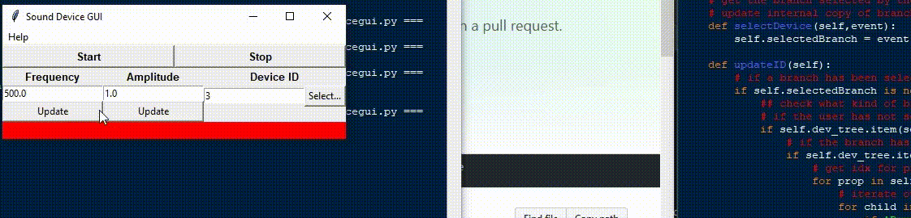
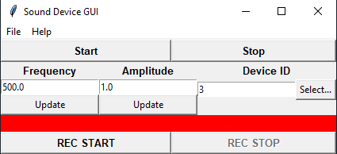
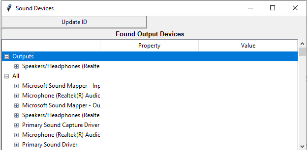
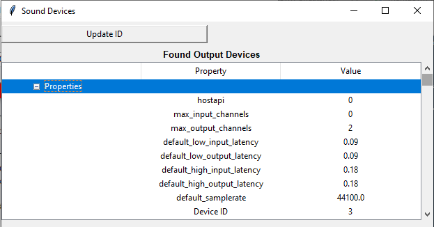

# Sine Wave Generator GUI

David Miller, 2019
University of Sheffield

The purpose of the GUI is to allow the user to generate a sine wave through a specific audio device. The user can control the amplitude and frequency and adjust them on the go

## Requirements
 - Numpy
 - sounddevice
 - tkinter + ttk

## Features
 - Control the frequency and amplitude of the sine wave
 - Find and choose the target device
 - List the devices available
 - Change the sine wave properties on the go
 
## Wanted Features
 - Graph displaying the generated signal
    + Would require multithreading/multiprocessing to manage the graph update thread separately. Trying to run the OutputStream requests and the Figure draw methods in the same thread causes the application to crash
 - Ability to record the generated signal
 
## Usage

In the magnetic impedance tomography rig to be built, the idea is to use the audio jack to supply the magnetic excitation signal. The signal is passed on using a multiplexer which controls which coil to excite. The purpose of the GUI is to test the connection between the Pi and the coils and test different wave settings to confirm the impact of the settings.

To use the GUI, the user needs to set the wave settings by typing in the respective entry boxes and clicking the respective Update buttons. The user then needs to confirm which output audio device the signal should be sent to. The program is initially set to use the default output device but can be changed by clicking the Select button. Using the buttons opens a separate GUI listing the available devices. It groups the devices under two headings; Outputs and All. Outputs are all the devices found labelled as Outputs and All is all the audio devices that could be found. The user can change the device by selecting one of the devices by name and clicking Updating ID. This updates the device ID used to reference the device.

To start producing the sine wave the user clicks the Start button. The color bar is changed to Green to indicate that sound is being produced. Clicking the Stop button stops the signal and updates the color bar to Red to show this. The audio is also stopped when the program is closed.

Clicking on the About option under the Help menu displays information about the author and GUI and provides a way of showing global program dependencies.

## Program Documentation
### AboutWindow class

This class is a Tkinter window displaying information about the Author and the GUI including version number and Copyright information.

The first window that appears shows information such as Author's Name, Copyright year, Author email address and version number. Clicking on the Libraries button collects and displays the global imports for the program and version numbers of they can be obtained.

#### AboutWindow methods
 - init(self,master)
   o Initialize window and widgets
 - showDependencies(self)
   o Collect and display the global dependencies for the program
   o The global imports are collected by iterating over the globals dictionary.
   o It tries two different methods to get the version number of the libraries
     1. It first sees if the documentations has a version attribute.
     2. If it doesn't have a version document attribute, then the get_distribution method of the pkg_resources module is used to try and get the version number.
     3. If the version number cannot be retrieved, then it is set as N/A
   o For each global module found, a tkinter Label is created with the text set to the module name followed by version number.
   o As the number of global dependencies tends to be small the window is kept to a reasonable size. If the number of global dependencies is large, then it is recommended to package the Labels into a Tkinter Frame and a Scrollbar added. This is left up to other developers.
   
### SoundDevicesGUI class

This class is the window displayed when the user clicks the Select button on the main window. The purpose of this is to collect and display the available audio devices so the user can choose one. The class collects the available devices using the query_devices method of the sounddevice module and assembles them in a tkinter Treeview.

The devices are grouped under two headings; Outputs and All. The Outputs group is for all the devices that are viewed as Output devices by the sounddevice library such as speakers. The All group is for every device found by an empty query_devices call including input devices. This is in case the default output device is not suitable or the desired device is not viewed as an Output device typically and the user needs to test something custom.

The properties of each device are also found and displayed for the user to inspect. The discoverable properties are from the dictionary of information returned by the query_devices call. The properties and their respective values are displayed under two columns in the treeview called Property and Value respectively. The properties currently found and displayed are as follows:

 - hostapi
 - Maximum number of Input channels for device
 - Maximum number of Output channels for device
 - Name of the device
 - Default low input latency
 - Default low output latency
 - Default high input latency
 - Default high output latency
 - Default samplerate
 
An additional property called Device ID is also displayed. This is the unique ID of the device and used to reference the device when sending the sine wave. The index is based off the device's index in the DeviceList returned when an empty call is made to sounddevice's method query_devices.

The user selects which device they wish to use for the next usage by selecting the device by name and clicking on Update ID. This will update Device ID value stored in the SoundGUI class and will be used next time the user clicks the Start button. If the user selects either of the top level groups, then the update is ignored. If the user selects one of entries under a device's Properties branch, then the update request is ignored. If the user has selected the device by name, the value under the Device ID branch is obtained and used to update the target Device ID in the SoundGUI class.

#### SoundDevicesGUI methods
 - init(self,selectedDevRef,master)
   + Initialize the window and treeview
   + selectedDevRef is a passed reference to the IntVar in the SoundGUI storing the target audio device ID
   + Find all the available devices and populate the treeview instance under the aforementioned groups
 - selectDevice(self,event)
   + Handler for when the user clicks on a branch of the treeview
   + Updates internal reference to branch to be used in updateID method
 - updateID(self)
   + Called when the user clicks on the Update ID button =
   + Checks if the user has correctly selected a device
   + If they have, it iterates over the branches under the Properties branch and searches for the Device ID branch
   + Once found the Device ID in the SoundGUI class is updaeted using the reference passed in the init method
 - findAudioDeviceID(devDict)
   + Static method for finding the index of the device descibed by the devDict in the DeviceList instance returned by an empty call to sounddevice's query_device method
   + This is used as the device's ID and if the main way of referencing devices
   + The dictionary passed is generated by more specific query_devices calls. The dictionary contains information such as device name and sampling rate.
 - addDeviceToTree(tree,devDict,devID,branch='')
   + Add the information stored in the passed dictionary devDict under the specified branch under the target tree. The devID is the device's device ID and can be obtained by using the findAudioDeviceID method.
   + The information inside the dictionary is parsed and added to the classe's treeview.
   + Each device has it's own branch distinguishable by the device's name and under these branches is a sub-branch called Properties that contains all the information stored in the device's information dictionary and the device's ID provided.
   
### SoundGUI class

This is the main window class first displayed to the user when they start the program. It provides controls to start and stop the production of the sine wave, the proprties of the sine wave and which device the signal will be sent to.

The Start button creates and instance of sounddevice's OutputStream class with the target device ID and settings retrieved by querying the device using the query_device method. The stream is then started sending the signal to the audio device. The coloured Label in the GUI is then changed to green to indicate that the stream has started. The Stop button stops this stream by calling it's abort and stop methods respectively. The abort method stops the stream without clearing any buffers and the stop method then clears the buffers. The abort method called first to make sure that stream has stopped. The stop method is called to clear up memory and keep the GUI as lightweight as possible. When stopped, the coloured label is changed to red.

The sine_callback is the function that actually generates the sine wave signal. It is passed as the callback function to the OutputStream class on its creation and generates new data whenever an audio request is made. The request states how many frames of data is required. The function then creates a time vector based off the number of frames and device's sampling rate which is when passed onto numpy's sin function that produces the amplitude data. The function references the set frequency and amplitude values when creating the data. The data is stored in an array internal to the OutputStream instance. A copy of the reference is kept by the class under the attribute auddata for debugging purposes. The data array is a multi-column dataset whereby the number of columns is the number of output channels of the device.

The callback is based off sounddevice's Play a Sine Wave .

The user can change the frequency and amplitude of the signal by changing the values in the respective Entry boxes and clicking the associated Update button. Only by clicking the Update button is the value actually updated. The value entered is not checked and it is left to the user to enter in an appropriate variable. The values can be changed even when the stream is active.

The OutputStream instance is stopped and cleaned up on exit.

The Help menu option provides access to Copyright and information on the author. The window is generated by the AboutWindow class

#### SoundGUI methods
 - init(self,master)
   o Initialize window and widgets
   o Set initial device ID to default output device currently set in sounddevice module
   o Frequency initially set to 500 hz and and amplitude set to 1.0
 - updateParam(self,param)
   o Update the target parameter param
   o Called whenever an Update button is pressed
   o Valid target parameters are "freq" and "amp" for frequency and amplitude respectively
   o Gets the value in the respective Entry box and uses the set method on the respective tkinter variable to update the value
 - updateStrStatus(self,args)
   o Change the status coloured label
   o Called whenever the internal BooleanVar representing stream status status_var is updated
   o Changes the color of the label to Green if it is True and Red if it is False
   o Disables the device ID entry box
 - startStream(self)
   o Start the process of producing the sinewave
   o Creates an instance of sounddevice's OutputStream targetting the set device ID and initialized using the device's paramters.
   o Request callback ste as sine_callback
   o Starts the stream and changes the value of status_var to True
 - stopStream(self)
   o Stop the sinewave is a stream instance is created
   o If the stream is active according to the OutputStream attribute active, the abort and stop methods are called. These stop the audio stream and clear internal buffers.
   o The status of the stopped attribute of the OutputStream is checked to see if the stream has been successfully stopped.
   o If the stream has been stopped then a message is printed to terminal, status_var is set to False and the device Entry box is renabled.
   o If the audio device wasn't stopped then an error message is printed along sys.stderr file
 - sine_callback(self,outdata,frames,time,status)
   o Callback handler for audio requests
   o Produces the desired number of data frames and updates the outdata buffer with channels of amplitude data
   o If the status variable has been set, then it is printed along sys.stderr and new data is **NOT** created
 - showAboutGUI(self)
   o Create and display an instance of AboutWindow class
 - selectDevice(self)
   o Create and display an instance of SoundDevicesGUI
