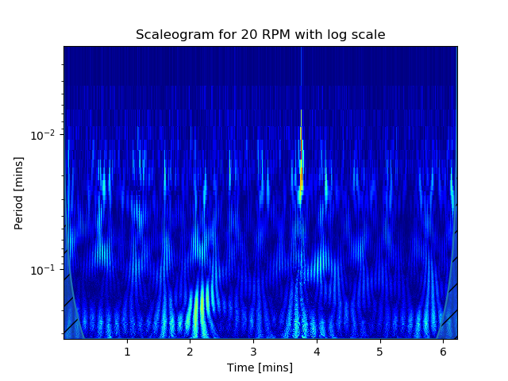
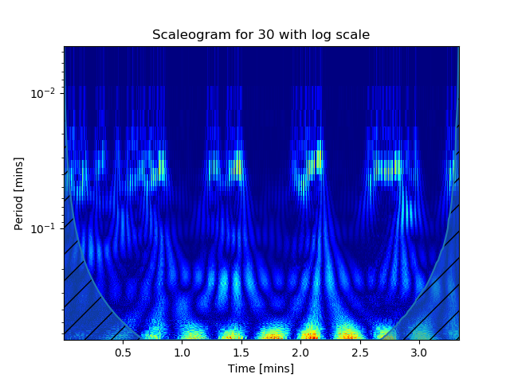

# Mass Flow Rate vs Scraper RPM

During investigations by the BEAM technicians, it was discovered that the mass flow rate of the powder varies greatly with the speed of the scraper. The plot below shows the mean mass flow rate plotted against the scraper speed with errors bars showing the variance.

It can be observed that the variance in the flow rate increases drastically between 6 and 14%. We can see this when we compare the plots of 4% and 6%.

| 4% of 10 RPM | 6% of 10 RPM|
|:------------:|:-----------:|
|||

Both plots contain two series; the raw data (blue) and smoothed data (red). You can see a drastic change in behaviour between the two plots with a high volume of noise being suddenly introduced. It was interest to analyse this data and identify the underlying dynamics. This document describes the methodology used and any conclusions that can be inferred.

## Software Requirements
  - [scipy](https://www.scipy.org/)
  - [openpyxl](https://openpyxl.readthedocs.io/en/stable/)
  - [matplotlib](https://matplotlib.org/)
  - [pywavelets](https://pywavelets.readthedocs.io/en/latest/)
  - [scaleogram](https://github.com/alsauve/scaleogram)
  
## Useful Links

[Gentle Intro to Wavelets](https://www.kaggle.com/asauve/a-gentle-introduction-to-wavelet-for-data-analysis). A starter guide by the author of the Scaleogram package on how to use the package and what wavelets are.

[Relationship between Scale and Freq](https://github.com/alsauve/scaleogram/blob/master/doc/scale-to-frequency.ipynb). A Jupyter notebook demonstrating the link between wavelet scale and frequency.

[Practical Guide to Wavelets](https://journals.ametsoc.org/doi/pdf/10.1175/1520-0477%281998%29079%3C0061%3AAPGTWA%3E2.0.CO%3B2). A regularly referenced starter guide to wavelets with examples of real datasets.

[Intro to Wavelets](http://www.acme.byu.edu/wp-content/uploads/2017/08/Wavelets.pdf). A more mathematically oriented introduction to wavelets.

## Scripts
  - [Fourier Analysis](massflowfft.py)
      + Reads in the data, parses it into the different speed groups and performs FFT on the raw mass flow data. 
      + The power spectrum results are saved as plots only.
  - [Wavelets Analysis](massflowwavelets.py) : 
      + Reads in the data, parses it into the different speed groups and performs Continuous Wavelet Transform on the raw mass flow data with a Morl Tier 1 mother wavelet.
      + The results are plotted as a scalogram to display the response to the child wavelet at different times and the respective periods.
  - [Generalized Processing Functions](processmassflowdata.py)
      + Generalized versions of the massflowfft and masflowwavelets scripts.
      + The general functionality of each is packaged into a separate function. If the dataset has quirks, additional columns etc. then a more specialised file needs to be implemented.
      + Creates and saves results to a folder based off the input filename.
      + Scale range currently fixed to np.arange(1,150)
      + processMFRWavelets(fname,ng,gnames,opath,save_data_plots,wavelet)
          + fname : Path to workbook containing the mass flow rate data
          + ng : Number of groups of data within the notebook. Cannot be inferred from contents
          + gnames : Names of each group. If None, then a list is built based off Group_{i} where i in the index of range(ng). Affects saved filenames. Default None.
          + opath : Output path for saving. A folder based off fname is created at the filepath and the results are saved there. Default is current location.
          + save_data_plots : Flag to control whether the raw and smoothed mass flow rate data is plotted and saved. Default True.
          + save_split_data : Flag to control if the different groups of data are split into separate files. Only saves the dT, raw mass flow and smoothed mass flow data. 
          + wavelet : Name of wavelet applied. See [here](https://pywavelets.readthedocs.io/en/latest/ref/wavelets.html) for supported formats. Default morl1.
      + processMFRFFT(fname,ng,gnames,opath,save_split_data)
          + fname : Path to workbook containing the mass flow rate data
          + ng : Number of groups of data within the notebook. Cannot be inferred from contents
          + gnames : Names of each group. If None, then a list is built based off Group_{i} where i in the index of range(ng). Affects saved filenames. Default None.
          + opath : Output path for saving. A folder based off fname is created at the filepath and the results are saved there. Default is current location.
          + save_split_data : Flag to control if the different groups of data are split into separate files. Only saves the dT, raw mass flow and smoothed mass flow data.
      
## Data
  - [T14 H3 316 0939](Data/T14_H3_316_0939/T14%20H3%20316%200939.xlxs)
  - [T15 H3 316 0939](Data/T15_H3_316_0939/T15%20H3%20316%200939.xlxs)
  - [T16 H1 316 0939 041](Data/T16_H1_316_0939_041/T16%20H1%20316%200939%20041.xlxs)

## Wavelets

One of the most popular ways of understanding a time-series signal is the infamous Fourier Transform (FT). It takes a given set of data and decomposes it into a series of cosines whose amplitudes and frequencies inform the user of the signal's composition. However, one of the biggest limiting factors is that it fundamentally doesn't take into account time. This comes particularly apparent when you have a dataset whose behaviours change over time. Lets say we have a dataset whose behaviour changes in distinct intervals. If we applied a Windowed Fourier Transform (WFT) to each distinct area, we'd get aliasing of high and low frequency components that do not fall within our window. In other words, by limiting the scope to a smaller area we are disregarding important that would help "describe" the local area.

The wavelet transform involves convolving a function known as the mother wavelet function across the time-series data.
  
## Results
### FFT
#### T14 H3 316 0939

#### T15 H3 316 0939

#### T16 H1 316 0939 041

| 8% | 10% | 15% | 20% |
|----|-----|-----|-----|
|||||

| 25% | 30% | 40% |
|-----|-----|-----|
||||

### Wavelets
#### T14 H3 316 0939
| 2%  | 4%  | 6% | 8% | 10% |
|---|---|---|---|---|
| |||||

| 12%  | 14%  | 16%  | 16%  | 20%  |
|---|---|---|---|---|
||||||

#### T15 H3 316 0939

#### T16 H1 316 0939 041

| 8% | 10% | 15% | 20% |
|----|-----|-----|-----|
|||||

| 25% | 30% | 40% |
|-----|-----|-----|
||||
