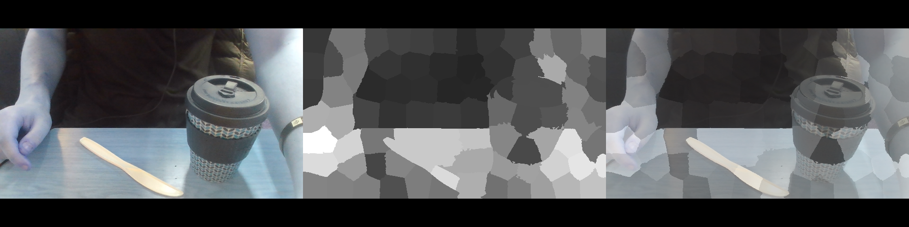

# Segmenting Powder from the Background

At the end stage of the hopper where the powder is moved by the scraper and is about to exit to be combined with the carrier gas, the powder loops back on itself to create an artifact. The artifact has been described so far as a spiral shape of decreasing width with the tail pointing towards the exit. The impact this has on the powder mass flow rate is unknown as precise characteristics of the artifact have not been logged before. It is therefore of interest to analyse this artifact and try to determine any correlations to recorded data.

However, as the target information/metrics is not known the first goal is to record and separate the powder from the background of the image. By correctly separating the powder from the background and any surrounding activity we can begin to estimate aspects of it.

## Software Requirements
 - Python v3 (built using v3.7.5)
 - Numpy
 - Scipy
 - scikit-image
 - OpenCV (cv2)
 - networkx

## Superpixels

A popular that has emerged in the past decade is the concept of superpixels. An image is inherently a lot of information to process with colour images easily containing hundreds of thousands of data points. As such, processing this information quickly and efficiently becomes a difficult task. A common approach to speed up algorithm processing speed is to downsample an image so that there's less information to process, but still has enough features to contain the necessary information. This still potentially leaves you with a lot of information to process. A better way is to classify regions of the image in a meaningful fashion. Think of it like a blurb of a book; it summaries the plot of the book enough for you to understand what it's about without having you read the entire book. 

The idea of superpixels is to "summarise" a region of an image by a single color value or metric. Conceptually this holds more meaning for humans as well as we don't view images as a set of pixels, we instead characterise it by the texture or lighting e.g. the lighting in the middle of the image is much brighter than the surrounding pixels. Computationally speaking, this reduces a very large, 3D dataset to a much smaller array of values (e.g. 50k x 50k pixels to 200 superpixels).

This concept can be used to segment by separating the superpixel values into different classes. For example, a superpixel with a high value might be an area with lots of lighting whilst a low value represents low lighting. We can therefore segment the image by grouping these superpixels and masking the image accordingly.

The script [superpixelsSLICPyImageSearch](Scripts/superpixelsSLICPyImageSearch.py) separates images collected from the default camera into superpixels using the SLIC algorithm implemented by skimage identifying each one based on a colourfulness metric. The results are converted to a grayscale mask that is displayed separately and overlayed with the original image in three windows. The code is based off [this](https://www.pyimagesearch.com/2017/06/26/labeling-superpixel-colorfulness-opencv-python/) article.

Below is a screenshot taken using the program, triggered by pressing the *s* key, providing an example of the results.

## Graph Cut

With superpixels, a large image can be reduced to a much smaller, representative dataset. This collection of values can be converted to a graph where each superpixel is a node on the graph and their positional relationship to each other is based on the position of the superpixel. Under this form the nodes can be separated/grouped/cut from each other by a range of algorithms. 

Graph Cut seeks to separate the graph into two groups with the minimum number of cuts possible. It separates the graph into two parts; a sink and a source. The two are grouped based on their similarity to each other (similar color values) and the boundary is the edge where the color values change from one to the other. A source in the context of an image, is a region of distinct color (e.g. a light source, a red ball, a yellow duck etc.) while a sink is another region of a different distinct color (e.g. a white background, a blue ball etc.). One way of thinking about it is as a waterfall with the water flowing from the top to the bottom. We know that the top and bottom are different by the different levels of activity, water levels etc. and the boundary that separates them is where the water falls down or where there's a distinct change in energy between the top and bottom.

## Superpixel Features

## Program Files
### [utilities](Scripts/utilities.py)
  - createOverlay
  - saveFilterResponseScreenshot
  - saveFiltersAsImages
  - calcNumRegions : Given a particular image shape and region size, estimate the number of superpixels that will be generated assuming spatial regularization is applied
  - calcRegionSize : Given a particular image shape and target number of superpixels, estimate the region size required to produce that many superpixels
  - drawBoundaries : Using the given boundaries mask, obtainable from a OpenCV superpixels algorithm, draw the boundaries using the given settings on the other image given. Controllable parameters the thickness, color etc parameters that can be passed to OpenCV drawContours function. Returns the drawing result.
  - useScreenshot : Opens the default camera, retrieves an image, performs SLICO segmentation and returns the image, the labels matrix and the segmentation class. Used in functions to get an image for testing other methods.
### [opencvEMTrain](Scripts/opencvEMTrain.py)
  - useCamera (**NEEDS UPDATING**)
  - useCameraGray (**NEEDS UPDATING**)
  - trainEMWithRGB
  - trainEMUsingScreenshotFeatures
### [descriptors](Scripts/descriptors.py)
  - normalizeFeatures
  - calculateColorEnergy
  - calculateGrayEnergy
  - calculateGreyEnergy2D
  - calculateColorMedian
  - calculateColorMean
  - calculateColorStd
  - calculateColorMeanGrad
  - calculateAllColorFeatures : Calculates and builds the color feature vector for given frame and superpixels labels matrix.
  - calculateAllGrayFeatures :
  - calculateTextureFeatureVector
  - computeFilterResponse
  
### [spgraph](Scripts/spgraph.py)
  - findSuperpixelCentres : Finds the centres of each of the superpixels defined in the given labels matrix. List of coordinates returned is in image space x,y coordinates.
  - formPosDict : Forms the position dictionary used when drawing the Graph using draw methods from networkx. The dictionary keys are the centres indicies and the values are the centre coordinates.
  - getNeighbours : Build or use a given KDTree based off the list of centres and build the connections between them based of N nearest neighbours. Returns a set of pairs describing between which nodes in the graph an edge is connected.
  - getPointsWithinRange : Build or use a given KDTree based off the list of centres and build the connections between them based off the points within a certain range. If the distance is not specified, the superpixel region size parameter set at the top of the script is used.
  - formNearestParis : Build or use a given KDTree based off the list of centres and build the connections between them based off nearest pairs.
  - findMeanEucDist : Finds the mean euclidean distance between list of centres. Uses scipy spatial distance pdist method to find the matrix of distances and returns the mean of that.
  - edgeWeightsPotts : Calculates the weighted edges list based off distance weighted Potts model. Weights are calculated as distance between nodes divided by mean distance. Mean distance calculated using findMeanEucDist.
  - edgeWeightsColor : Calculates the weighted edges list based off the normalized color distance between nodes. Color distance is described as euclidean distance between mean colors of superpixels and standard deviation of all colors. See paper for exact formula.
  - edgeWeightsFeatures (**NOT FINISHED**) : Calculates the weighted edges list based off the distance between feature vectors. See paper for exact formula.
  
### [opencvSuperpixelGraph](Scripts/opencvSuperpixelGraph.py)
  - screenshotCentres : Gets a frame from the default camera, performs SLICO superpixels segmentation and draw the SP centres on the image obtained. The showBoundary flag controls if the drawBoundaries function is called as well to draw the superpixel cell boundaries on the image.
  - buildScreenshotGraph : Gets a frame from the default camera, performs superpixel segmentation, calculates the centres and attempts to build a networkx Graph with weighted edges. The algorithm used to generate the weighted edges is controlled by the wtype parameter. Currently accepted forms are 'potts', 'color' and custom functions that accept the image taken, the superpixels labels matrix and the list of centre locations. It currently returns the Graph object, the KDTree built off the centres and the list of centres itself.
