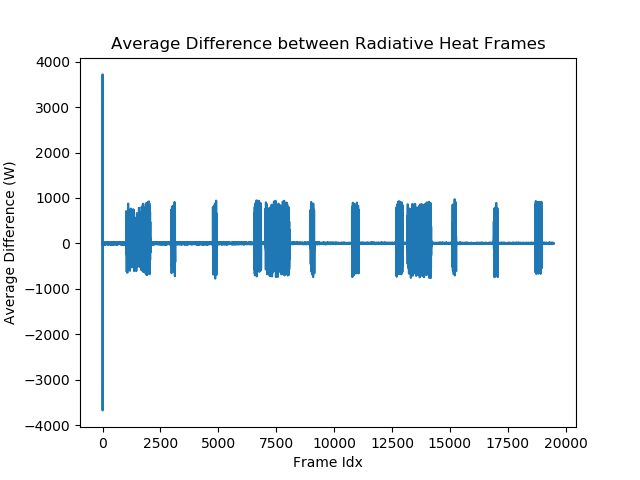
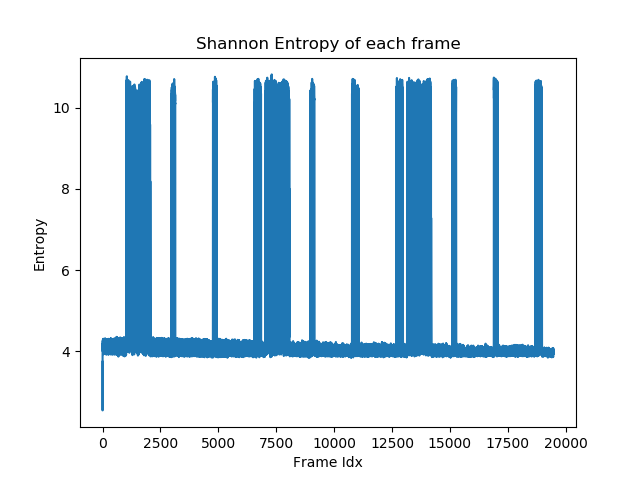

# Distance/Activity Metrics to Better Identify Laser Boundary
This program looks at a wide range of metrics to identify which one best clarifies the border of the laser area of effect.

## Requirements
  + [Numpy](https://www.numpy.org/)
  + [SciPy](https://www.scipy.org/)
  + [OpenCV v4.x.x](https://opencv.org/)

## Introduction
When the laser is turned on, it heats up an of the material causing a drastic change in values recorded by the thermal camera. The plot below shows the average change between the raw data frames.

The large spike at the beginning is caused a large unexplained jump in values in the second frame of the data. The spike and mirroring trough is the change happening and the data going back to "normal".

The change in values when the laser is turned on is clearly distinct and stands out above the change caused by noise.

Another way to monitor and detect change in the data is to look at the entropy of the data. This is a singular metric that represents the amount of information or disorder, depending on how you view it, containing in the image. The metric Shannon Entropy is applied to images and shows the amount of entropy in the image. The plot below shows the Shannon Entropy of the data when the data is cast to 8-bit unsigned integer.

The same data evaluated two different ways produces quite different plots.

Different distance metrics will weight the change between frames differently. As they are applied to a matrix, some will take into accound characteristics of the matrix such as its determinant. If the determinant is zero, for example, many metrics cannot be computed. This behaviour provides a means of narrowing down what metric can be applied.

In the script, the Scipy function [cdist](https://docs.scipy.org/doc/scipy/reference/generated/scipy.spatial.distance.cdist.html) evaluates the distance between two collections of values according to the specified metric. Part of the script tries out each metric on the difference between the first and second frames of the list. If it fails to evaluate, then it is assumed that is cannot be applied to the rest. Out of the 21 possible metrics only 16 successfully calculated the distance between the two. Many metrics cited the problem to a zero determinant occuring.

-- LIST NEEDS TO BE MODIFIED--
+ ‘braycurtis’
+ ‘canberra’
+ ‘chebyshev’
+ ‘cityblock’
+ ‘correlation’
+ ‘cosine’
+ ‘dice’
+ ‘euclidean’
+ ‘hamming’
+ ‘jaccard’
+ ‘jensenshannon’
+ ‘kulsinski’
+ ‘mahalanobis’
+ ‘matching’
+ ‘minkowski’
+ ‘rogerstanimoto’
+ ‘russellrao’
+ ‘seuclidean’
+ ‘sokalmichener’
+ ‘sokalsneath’
+ ‘sqeuclidean’
+ ‘wminkowski’
+ ‘yule’

In the script is an attempt to construct a dictionary of the results found where the key is the applied distance metric. However the initial run ran for 18+ hours and hadn't finished. It was estimated that it would take over 3 days for the script to finish running. A successful run has yet to be completed. The list of metrics needs to be narrowed down further in order for the evaluation to be completed in a reasonable time.

It can easily be intuited that simple metrics like Euclidean would be successful regardless of the data as it looks at the raw distance between values and minimally weights it with no reliance on matrix parameters like the determinant.

## Developer Notes
  + As noted it takes a REALLY long time to run the list of 16 metrics. If you want to attempt it, do it on a really good computer.
  + At the bottom of the script is a section that creates folders for the results based off the listed name of the metrics. These are created in the current working directory. That portion of the script is untested.
