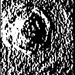
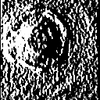
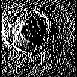
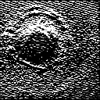
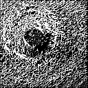
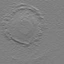
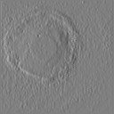
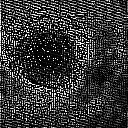
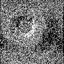

# Edge Detection Methods

This folder shows the results of trying different edge detection methods on the normalized estimated power density frames
to see which method produces the best results. The goal is to take the best method and apply it to the data to produce higher
quality edge information to OpenCV's Hough Circle implementation. The hope is to improve the quality of the power estimate.

## Requirements
 - Scipy
 - Matplotlib
 - Cmapy
 
## Range of methods

Edge detection methods grade changes between pixels according to a specific methodology. How it's graded depends on what characteristics
of the edge the method is interested in. Some may rate complete enclosing boundaries higher while others are more interested in the similarity
of boundaries found in the data.

OpenCV has support for a range of different methods and the following ones were tested on the normalized power density matricies.

- Sobel (X direction, Y direction and sum of X & Y)
- Laplacian
- Scharr (X direction, Y direction and sum of X & Y)
- Prewitt (Vertical direction, Horizontal direction and edge results)
- Sum of difference row and column wise

## Results

| Sobel X | Sobel Y | Sobel Sum |
|-|-|-|
||||

| Scharr X | Scharr Y | Scharr Sum |
|-|-|-|
||||

| Prewitt Horizontal | Prewitt Vertical | Prewitt Edge |
|-|-|-|
||||

**Laplace**

**Difference**

