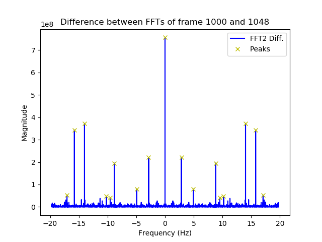
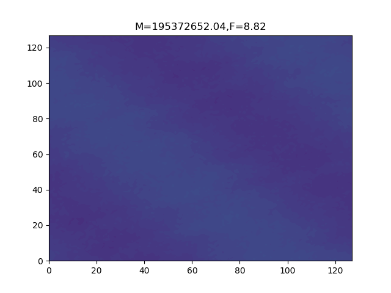
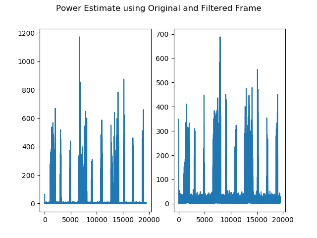

# Fourier Filtering
This script tries to filter the power density matricies for just the 2D Fourier artifacts introduced by the laser when it's turned
on.

## Requirements
  + [Numpy](https://www.numpy.org/)
  + [SciPy](https://www.scipy.org/)
  + [OpenCV v4.x.x](https://opencv.org/)
  
## Introduction
When the laser is turned on, it causes a distinct change in the behaviour of the data in a limited area. As the laser isn't turned
on all the time, it's a distinct change that can be measured and quantified.
  
The Fourier transform is an algorithm that searches for the magnitude and frequency of the components that collectively makeup the data. When applied to 2D data it shows how often certain numerical magnitudes occur across the matrix. In this case, the frequency is how often the components occur across pixel space.

Applying the Fourier transform to the difference between a frame where a laser isn't on and one where it is will reveal the
components that have been introduced by the laser. If the strongest components can be identified accurately then future matricies
can be filtered for just these components. The laser power can then be estimated more clearly as hopefully the boundary can be more easily identified.

## Identifying the Frequencies
The first step is to look at the Fourier Transform of the difference between an inactive frame, where the laser isn't on, and an active frame, where the laser is turned on. The difference between frames 1000 and 1048, inactive and active respectively, of the arrow shape dataset were chosen for this purpose.

The plots below show the magnitude and frequency of the FFT of the difference between the two frames. Under this colormap, blue is the lower magnitudes and yellow is the upper magnitudes.

The centre of the magnitude image represents the DC mean of the plot. This means its magnitude represents a blanket addition to the data applied uniformly. Magnitudes that occur to the right of the DC mean along the x-axis represent artifacts that occur periodically along the x-axis of the image. Magnitudes that occur above the DC mean along the y-axis represent artifacts that occurs periodically along the y-axis of the image. Magnitudes that occur diagonally relative to the centre occur along the diagonal of the matrix (corner-to-corner). The natural symmetry that occurs with FFT results means we get equivalent negative frequency that occurs in the negative direction (left and down).

It can be clearly seen that there are components occuring at and around the DC mean. This indicates an increase in all values and the introduction of low frequency components. Pairs of higher frequency components can be seen occuring along the y-axis and at a slight diagonal. There is also a feint line occuring across the width of the plot indicating noise that covers the entire width of the matrix. This is likely the two noise "bands" that occur at the top and bottom of all frames.

We can convert this plot to a 1D plot to make the results more readable by flattening the matrix into a 1D vector and sorting the values by frequency. The plot below is the same results as a 1D plot with the strongest frequencies marked by yellow X's. The frequency has been converted from radians to Hertz for convinience.

The peaks marked are those that are above 5% of the maximum magnitude. This is to reduce the number of frequencies to search for in the filter.

If we perform the inverse fourier transform (IFFT) on frequency data, we are reconstructing the data that this frequency data represents. The IFFT of the data looks like this:

When the IFFT is performed, not all of the complex values in the FFT data are converted to completely real values. When this data is plotted as a contour, only the real parts of the numbers are displayed hence the negative part noted in the colorbar on the right.

As you can see, the data clearly captures a distinct area of behaviour

If we take each of the distinct components marked in the 1D plot earlier and perform an IFFT on each of them, we can see what each component adds to the mix.

The first plot represents the sum of the components while the rest represent the components with frequencies. The DC mean component has been delibarately left out.

Lets look at two example components:

|                     |                     |
| ------------------- | ------------------- |
| | |

The titles of the plots represent the magnitude and frequency of the respective components.

The component on the left is an example of the diagonal frequency components mentioned earlier. It has clear components as parallel lines across the image. The component on the right is simpler with a strong component occuring across the width of the image in a straight line.

The components plot earlier was scaled to each components limits. If the components were scaled according to the limits of the sum of the components, we can see the individual contribution of each one.

If we look at the example components from earlier under this scaling they look like this:

|                     |                     |
| ------------------- | ------------------- |
| | |

As you can see, no singular component contributes the majority of the behaviour. This tells us that we need to filter for all the frequencies instead of a specific subset.

Now that the distinct frequencies are known, we can start searching for them in the data and seeing what impact they have on the results.

## Filtering Results
The function filterFreq searches the given power density matrix for the list of frequencies given and returns a populated matrix with the values that satisfy the frequency requirement. One important parameter of any filter is the tolerance or the width of the window depending on how you view it. In other words the filter performs a check to see if any values satisfy the condition:

 

The following shows the power profile without any filtering and the power profile when filtered using the specified tolerance.

|                                 | 
| :------------------------------:| 
| Tolerance 0 Hz                  |
| |
|                                 |
| Tolerance 0.1 Hz                |
| |
|                                 |
| Tolerance 0.2 Hz                |
| |
|                                 |
| Tolerance 0.3 Hz                |
| |
|                                 |
| Tolerance 0.4 Hz                |
| |
|                                 |
| Tolerance 0.5 Hz                |
| |
|                                 |
| Tolerance 0.6 Hz                |
| |
|                                 |
| Tolerance 0.7 Hz                |
| |
|                                 |
| Tolerance 0.8 Hz                |
| |
|                                 |
| Tolerance 0.9 Hz                |
| |

As you can see, the frequency tolerance has quite a big impact on the magnitude of the power estimate and the degree of detectable noise when the laser isn't turned on.

The next plot is one possible way of showing the accuracy of the estimate. It shows the average distance between the peak values that are at least 5% of the maximum estimate and the known target power of 500W. The filtering of the peaks is to ensure that the average is based off the distinctive power estimates rather then the small estimates that can occur when the laser is turned off.

As you can see, there isn't a straight forward relationship that can help identify the best tolerance. Other statistical measures can of course be used to measure the accuracy. This metric also doesn't take into account the average power loss of the laser specification which is the average difference between the requested power and the actual power.

When the tolerance range is increased to 0.0 to 4.95 Hz (with a resolution of 0.05Hz) we get a more interesting picture. Below is the average distance plot for that data range.

As you can see, when the frequency tolerance exceeds 2.7 Hz the filtering has no impact on the average distance implying it has no noticeable impact on the power profile. This likey because the combination of the filtering windows encompasses the entire frequency range meaning filtering no longer has an impact.

The tolerance which yields the closest estimate according this metric is 1.9 Hz. The power plot alongside the original power plot is below:

The giant spike at the beginning is caused by a unexplained spike in the second frame of the data set. It is normally ignored in the default run. The second and third best profiles are shown below:

| 2nd Best Tolerance 1.75 Hz | 3rd Best Tolerance 0.15 Hz |
|:-:|:-:|
|||

## Developer Notes
  + The filtering process is wrapped as a function called filterFreq so it can be applied to other datasets
  + A function called findFilterFreq is also provided that searches for the distinct frequencies introduced by the laser. It searches for the frame with the highest values and looks at the difference between that frame and an inactive frame. By default the inactive frame is the first frame but it can be changed. The percentage tolerance used to filter peaks can also be adjusted.
  + A wider and higher tolerance range is to be tested at a later date. The results will be added.
