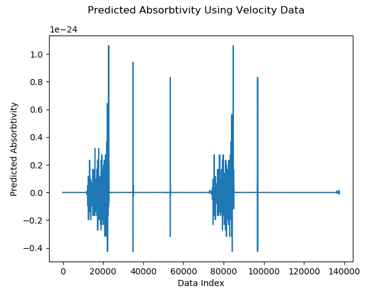
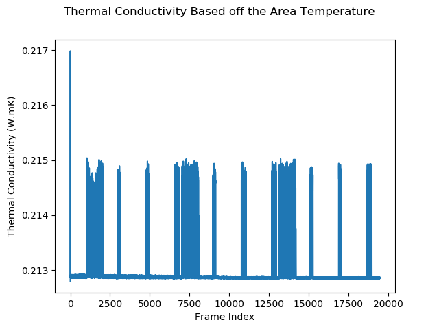
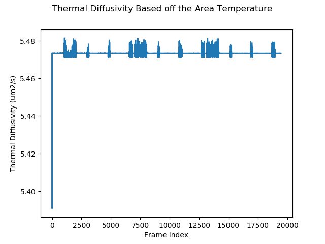
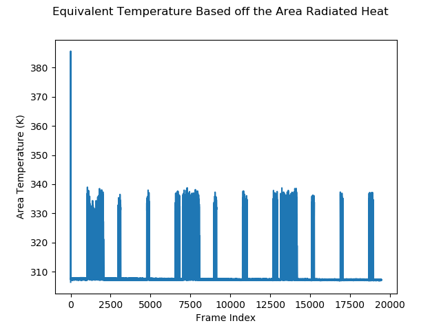
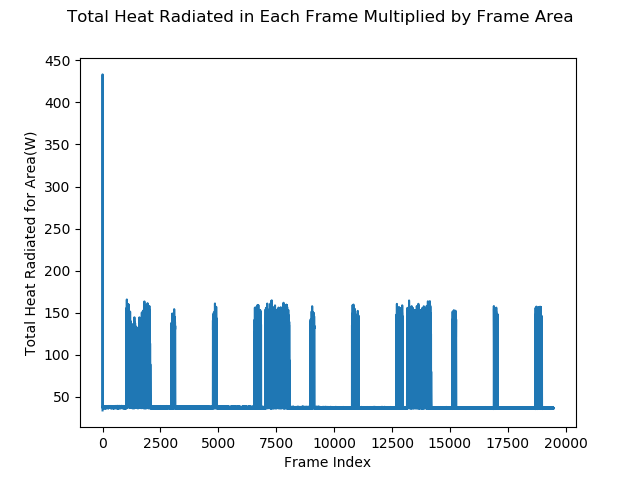
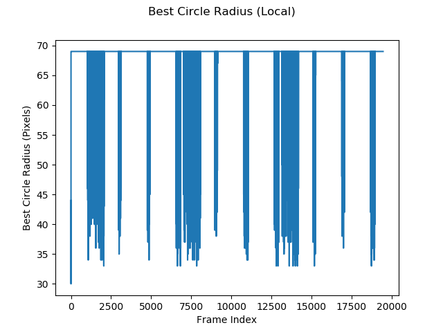
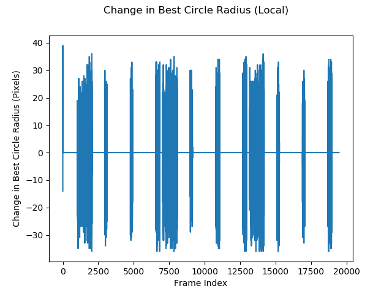
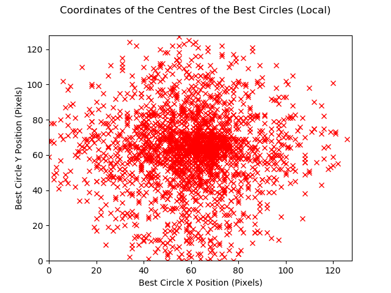

# Hough Circle Metrics

This folder holds information regarding metrics and information about the Hough Circles found in the thermal data.

This is kept separate from the power data as while it is related to the investigation of utilizing the Hough Circle
algorithm, it is not related to the power information.

## Requirements
 - Numpy
 - Skimage
 - Matplotlib
 - Scipy
 
## Scripts
### absorbtivityrelations.py

This scripts processes the specified thermal data and logs information about the Hough Circle that is closest to the target power of 500 W. The recorded data is saved to two CSV files: [thermal-hough-circle-metrics-local](thermal-hough-circle-metrics-local.csv) and [thermal-hough-circle-metrics-global](thermal-hough-circle-metrics-global.csv) representing the results for the locally normalized data and the globally normalized data respectively. The files both have a header row describing what the data is and the units if any.

The following data recorded and saved in the following order:
 - Radiative Heat for the Area (W) : (Calculated as the sum of the thermal data times the area of the frame in metres)
 - Thermal Conductivity for the Area (W.mK) : (Thermal Conductivity based off the Radiative Heat for the Area)
 - Thermal Diffusivity for the Area (m2/s) : (Thermal Diffusivity based off the Radiative Heat for the Area)
 - Temperature for the Area (K) : (Calculated from the Radiative Heat for the Area)
 - Radius of the Best Circle (Pixels) : (Radius of the Circle whose power estimate is closest to 500W)
 - Accumulator Score of the Best Circle (no units) : (Score assigned by the Hough Circle algorithm to the circle whose power estimate is closes to 500 W)
 - X Position of the Centre of the Best Circle (Pixels) : (X coordinate in matrix space of the centre of the circle whose power estimate is closes to 500 W)
 - Y Position of the Centre of the Best Circle (Pixels) : (Y coordinate in matrix space of the centre of the circle whose power estimate is closes to 500 W)
 - Distance of the Centre of the Best Circle (Pixels) : (Euclidean distance from the centre of the image to the centre of the circle whose power estimate is closes to 500 W)
 
The above information is plotted on its own and against each other in a number of ways including their numerical derivative. The plots should be recreatable from the logged data.

**WARNING: This script took +3 days to run using the Arrow Shape data (CPU only). If users which to run this script for themselves, it is heavily
advised that they ensure their machine is reasonably powerful and they have the time to do so**

The script also reads in the absorbtivity polynomial coefficients generated by the [AbsorbtivityData](../../../AbsorbtivityData/AbsorbtivityData.py) script and plots the absorbtivity profile using the velocity data saved in the Arrow Shape[XML file](01 Input/from UoS/Data/ControllerLogs/arrowLog.xml) and a constant power of 500 W. The coefficients are also provided in this folder and the script reads from this local copy.

For details on how the information was generated and can be used elsewhere please inspect the script and the [ReadMe](../../../AbsorbtivityData/ReadMe.md).

## Plots
### Absorbtivity

### Thermal Conductivity

### Thermal Diffusitivty

### Temperature

### Radiative Heat

### Best Circle Radius

## Best Circle Centres
| Local | Global |

### Best Circle Accumulator Score

### Best Circle Centre X Coordinate

### Best Circle Centre Y Coordinate

### Distance from Image Centre

