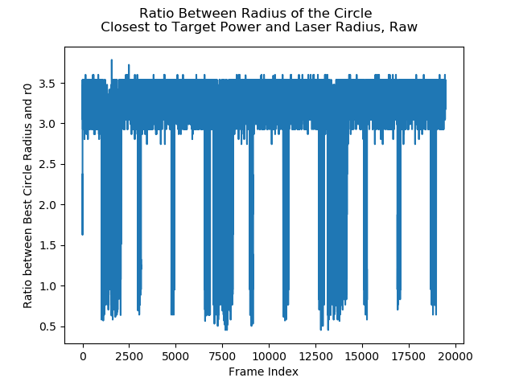

# Hough Circle Transform

This file is based around the investigations into applying the Hough Circle transform to estimate the boundary of the laser's area
of effect.

## Requirements
 + [Numpy](https://www.numpy.org/)
 + [SciPy](https://www.scipy.org/)
 + [Skimage](https://scikit-image.org/)
 + [OpenCV v4.x.x](https://opencv.org/)
 
## Introduction

The Hough Circle transform is an algorithm that searches for the presence of a circle in the given image. It searches the image
for circles whose radii falls within a specified range and ranks the validity of each circle according to an internal accumulator
score. The higher the score the more likey the circle is actually present in the image. This technique is highly effective and
comes in many forms depending on what the search criteria acts on. It is in fact an extension of the Hough Line Transform which
searches for lines of pixels in an image.

The waist of the laser irradiance expands the further the laser has to travel. Its waist starts off with as the laser radius and
then expands until it reaches some value. The further the laser has to travel, the more the waist increases. When we view the area of
effect from a top down perspective we can see that it is mostly circular and has a distinct border.

As the behaviour of the laser is distinctive and the magnitude is many times greater than the background noise in the image it should,
be detectable.

## Programs
[edgedetection](estimatinglaserboundary.py.py)

[edgedetection_skimage](estimatelaserboundary_skimage.py.py)

[morphologicaltransforms](morphologicaltransforms.py)

## OpenCV's Implementation

OpenCV implements a version of the Hough Circle transform that acts on information about the gradient of edges within the image
known as Hough Gradient Method. It first performs the Sobel operator on the image which is a discrete differentiation operation 
that searches for changes in values indicative of an edge. The operation is performed in the X and Y direction of the image. The results
are then processed together using the Canny Edge detecting algorithm to remove noise and pickup the more distinct edges in the
image. The preprocessing steps help reduce the number of false positive made in the image. As such, the function typically
returns only the most dominant of circles if any.

## Skimage's Implementation

Skimage's implementation is a much more direct approach of the algorithm and acts directly on the image without any preprocessing.
It tries to find and fit every possible circle within the discrete radii range that is provided and stores their score. As such, it takes gathers, processes
and returns more information than OpenCV's implementation resulting in a longer run time. Also, skimage operates purely in the
Python environment while OpenCV is actually implemented in C and C++. As Python is an interpreted language it is inherently slower
due to the overhead required to maintain the environment while C and C++ programs are compiled into largely standalone executables
that don't require an environment to run in. While the full results returned are useful when developing deeper custom processing methods,
the majority of the results have low accumulator scores with only a fraction of them having any significance.

Both implementations need to be investigated to determine which one generates the better results.

## Limitations and assumptions

As the laser system in question combines two lasers to form its beam, the standard methods for estimating the laser width and knowing
how it varies over height don't apply. Additionally, we haven't been informed as to how high the laser emitter actually was from
the workpiece in the dataset we have. As such we have to perform the Hough Circle transform over a wide range of radii. 
The information gathered about the size of the laser's boundary could be useful for future research endevaours.

From visually inspecting the data, we can see that the laser's irradiance area is always within range of the thermal camera.
This means that even if the AOE started in the direct centre of the frame, the waist cannot exceed the width of the image (128 pixels).
A common assumption about laser behaviour is that the distribution is similar to that of a Gaussian. A Gaussian distribution's waist
gradually increases until it reaches a certain point where it increases rapdily due to its exponential nature. With a Gaussian,
99.7% percent of its values within four standard deviations of where the peak occurs. The laser width is equivalent to the Gaussian's 
standard deviation and as such we can say that that the range of possible radii to search is from the laser radius to four times the
laser radius.

## Results

### OpenCV and Naive Casting
The naive casting approach involves interpreting the 64-bit float as an 8-bit unsigned variable. As a result, a wide range of float values are interpreted as 255 causing a lot of detail about the shape and structure of the power density to be lost. While this was the simplest approach, the information lost greatly degrades the quality of the results especially when compared to the skimage Hough Circle results.

As a first approach, the raw differences between power density estimates was used. The difference between power density frames row wise and column wise was calculated and summed together. As can be seen from the below frame, the change caused by the laser when it is turned on reveals the boundary of the laser quite distinctly.

OpenCV's Hough Circle transform was then applied to these results to see how well it could detect the boundary.

A common assumption with laser behaviour is that it follows Gaussian behaviour. One of the features of Gaussians is that 99.7% of the values are within four standard deviations of the peak. In this case, the standard deviation is the laser radius and can be converted to pixels using the known pixel pitch. As the radius of the laser cannot be smaller than the laser radius, the radius range is from the laser radius to 4 times the laser radius. Below is a plot showing the radius of the circle whose power estimate is closest to 500W.

The laser radius is 0.35 millimetres and as we can see from the plot the best circle radius is within this range. The drops in radius coincides with spikes in power density. The makes sense as when the laser is turned off, the best circle is going to be large as a large collection of small values are required to be closest to 500W. When the laser is turned on, it is noted in other methods that the estimated power bounces up and down between 0 and 500W.

When we plot the best radius as a ratio to the laser radius we get the following plot.

We can more clearly see that the spikes and they better coincide with the peaks in the power density.

Another metric that is logged in the program is the average distance between circles. While this serves no functional purpose, an interesting correlation occurs.

The average distance increases when the power density spikes. This can be seen when we look at the circles detected in frames with and without the laser turned on.

|Laser OFF, 1047|Laser ON, 1048|
|:-:|:-:|
|||

Choosing the best circle is difficult as OpenCV's function preprocesses the circles in some manner and likely returns the highest scoring circles. Unfortunately it does not return the accumulator scores of the returned circle for ease of use for casual users.

One way of filtering circles is to take advantage of how the camera is positioned in relation to the laser. As the camera is positioned to the one side of the laser, the area heated by the laser is also offset from the centre. This can be taken advantage of by setting the pixels which won't be heated by the laser to zero. 

Below is a plot of the impact of clearing different ranges of pixels in the difference frame 1048 (difference between 1047 and 1048) on how close the best circle gets to 500 W. The masking percentage in the plot refers to from which column to the masking starts. So a 50% means the masking starts from halfway in the image to the right hand side. The best circle is regarded as the circle whose power estimate is closest to 500 W.

The best masking percentage was found to be 66% which makes sense as the laser area of effect occurs to the left when plotted as an image so the ideal image was going to be above 50%. You can also visually confirm this by looking at a frame where the laser is active.

Another way to remove irrelevant circles is to use morphological transforms.

#### Morphological Transforms

This is a class of transforms that acts primarily on the shapes and their boundaries. There are two main operations; eroding and dialating (see [here](https://docs.opencv.org/4.1.0/db/df6/tutorial_erosion_dilatation.html) for more information about implementation and specifics).

Dialating seeks to expand the boundaries of shapes removing any gaps within the shape (removing noise) and making the shapes more complete and therefore easier to detect. Eroding performs the conceptually opposite action and removes smalls shapes and reduces the thickness of boundaries. This removes small shapes so that only the largest and most prominent shapes remain.

In this instance, we are using the transforms to remove the noisy objects and and improve the quality of the laser boundary making it easier to detect.

Different combinations of eroding and dialating have their own names. Opening is when an image is eroded and then dilated while closing is dialation and then erosion.

### Skimage and Locally Normalized Frames
DISCUSSION ABOUT NORMALIZED CASTING RESULTS

 

 

## Developer Notes
+ Due to the amount of information collected, these scripts can take a while to run
+  takes at least 3 days to run.

