# Canny Parameter Search
Searches a 2D parameter space to find the values that will give the best power estimate using the example frame

## Requirements
  + [Numpy](https://www.numpy.org/)
  + [SciPy](https://www.scipy.org/)
  + [OpenCV v4.x.x](https://opencv.org/)
  
## Introduction
Canny Edge detection is an image processing algorithm that searches for collections of pixels that likely define the edge of an object. The metric for this is the gradient or difference in value relative to its neighbours. This algorithm differs from the just a contour finding algorithm as it pre-processes the data to remove noise to only find the values that stand out. Thanks to this noise filtering, it is regarded as one of the best edge detection functions available.

A pixel is regarded as a line if its processed gradient is above a set threshold. If it is, then the algorithm is reasonably certain that the pixel belongs to an edge. Conversely, if the processed gradient is less than a set lower threshold then the algorithm is reasonable certain that the pixel does not belong to an edge. Any pixels whose values fall in between the thresholds is not certain whether it is or is not an edge and therefore discards it.

At present there is no universal way of selecting these parameters for a given image. A general approach is to use the median or mean value of the image and set the thresholds as a target metric plus or minus a percentage of the target metric. 

| Mean | Median |
|:-:|:-:|
||  |

This approach tends to work for images with normalized histograms or ones that are well distributed such as this:

|Example Image|Example Image Histogram|
|:-:|:-:|
| | |
|Canny Using Mean|Canny Using Median|
|||

[Source](http://www.kerrywong.com/2009/05/07/canny-edge-detection-auto-thresholding/)

When using median or mean doesn't produce adequate results, equalizing the histogram can improve the results. However, when applied to the problem at hand it yields poor results. When we try using the mean and median with a 33% tolerance on the values we get the following results.

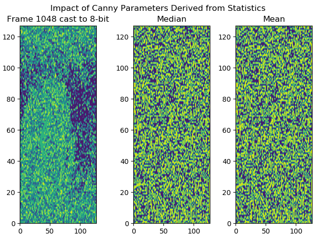

A histogram with a narrow band values indicates there is in intensely strong artifact in the image typically obscuring anything else (e.g. bright spot). The goal of histogram equalization is to take this narrow band stretch it out. A well balanced image with have a fairly level histogram over a wide range of vaues.

[Source](https://docs.opencv.org/4.1.0/histogram_equalization.png)

However as you can see from the histogram plot of an example frame cast to 8-bit below, the histogram is already very level.

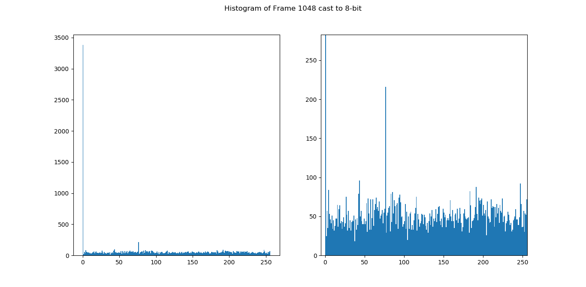

The plot on the left is the entire plot and the plot on the left is a zoomed in portion so you can see the details in the majority of values.

When global histogram equalization is applied it has minimal to no effect on the image.

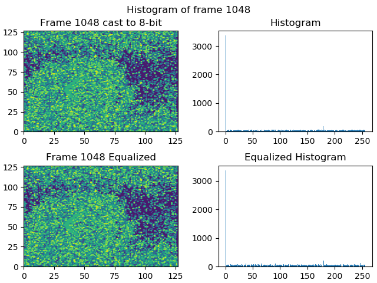

While there are adaptive histogram equalization methods (e.g. [CLAHE](https://docs.opencv.org/4.1.0/d5/daf/tutorial_py_histogram_equalization.html)), it still requires that band of values to work.

Below are the results when CLAHE is applied to frame 1048:

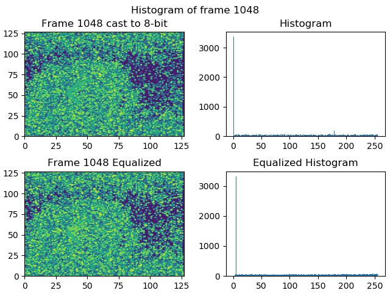

## Brute Force Approach
As standard pre-processing methods don't work on our data set, a brute force approach is required to find the ideal parameters. Our metric for evaluating a particular pair values is how close the power estimate is to the target power. With the arrow data set, the target power is 500 Watts.

The brute force approach tries each pair of values in a 2D parameter space. The parameter space is the range of lower threshold values and it's ratio to the upper threshold. This arrangement was chosen for no other reason other than it's a place to start.

The process of searching is as follows:
  + Cast matrix values to unsigned 8-bit (required for the image processing algorithms to work)
  + Apply Canny Edge detection algorithm to matrix using current pair of values as parameters
  + Search for the largest contour in the image
  + Sum the power density values within the contour
  + Multiply the results by the contour area in terms of metres squares
  + Return result
  + Evaluate distance from target power value
  
The matrix values are cast to unsigned 8-bit as the image processing algorithms only work with matricies of that type.

As any relationship between the parameters and the end power is unknown, a cost function to more efficiently search the space cannot be derived.

Below are the results of searching a lower threshold range of 0 to 255 and a ratio range of 1.0 to 6.0. The ratio range does not start at 0.0 as it ensure that the upper threshold is higher than the lower threshold. The ranges were arbitrarily chosen.

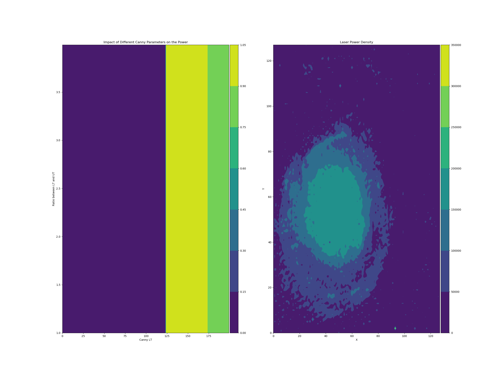

Note: Ignore the colorbar limits are they are incorrect for the data range

As you can see there is an ideal parameter range within this data range, but upon further inspection the distance to target power using these parameters is still quite large. 

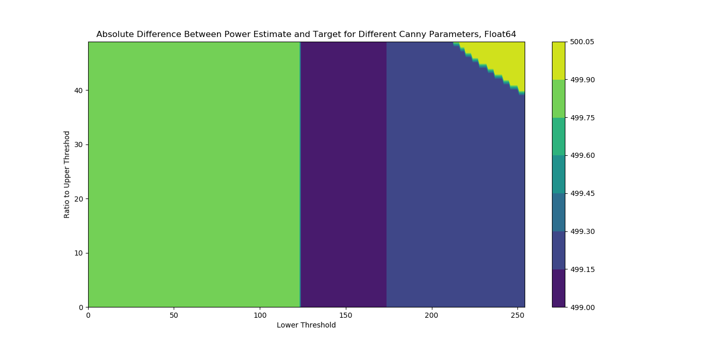

## Normalization
An approach that was investigated to try and maintain the same detail as the original matrix is normalization. The current method of casting involves interpreting the 64-bit float value as an unsigned 8-bit integer. This naive casting causes the noise to become large and corrupt the boundaries and the overall behaviour. A smarter approach to maintain the relative difference in values and the spread is to normalize the values and then scale to the appropriate data limits. As OpenCVs algorithms largely operate on 8-bit images, the values are then scaled to the range 0-255.

The plot below shows the difference between the two methods:
INSERT PLOT HERE

As can be clearly seen, the details and boundary is clearer in the normalized frame rather than the Numpy astype casting. The histogram is noteably different as well:

| Naive | Normed |
|:-:|:-:|
|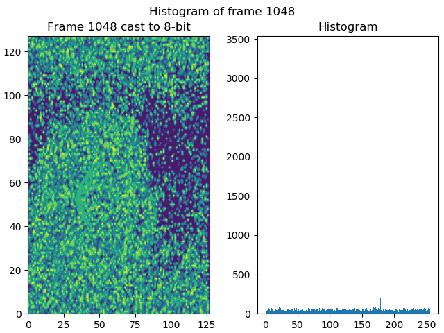|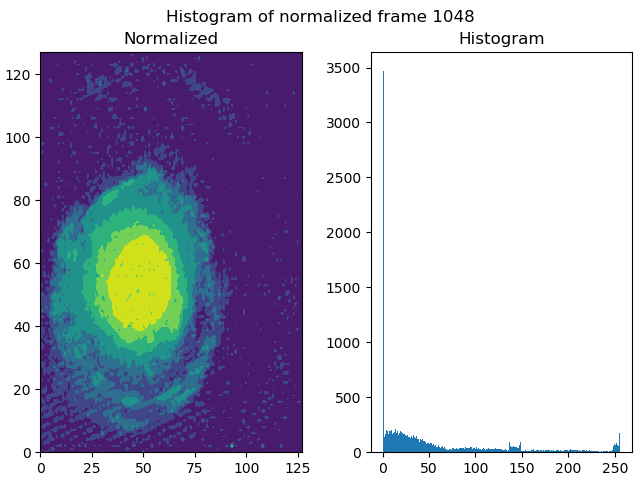|

As can be seen, the histogram of the normalized frame has a greater range of behaviours. These behaviours provide something for the equalization to act on. Below are the results of global and adaptive equalization/
| Global Equalized |
|:-:|
|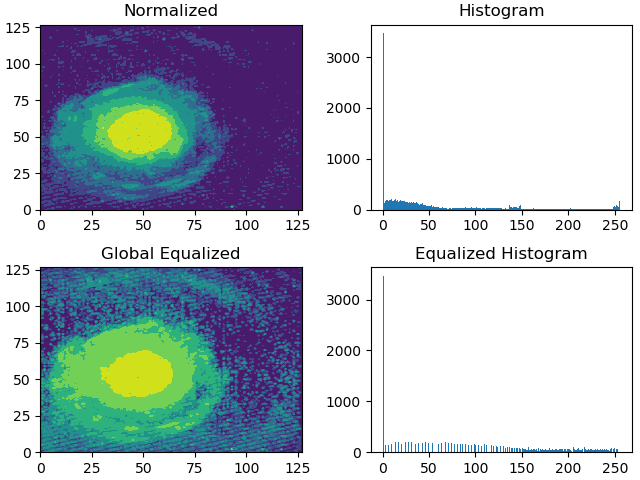|
| CLAHE Equalized |
|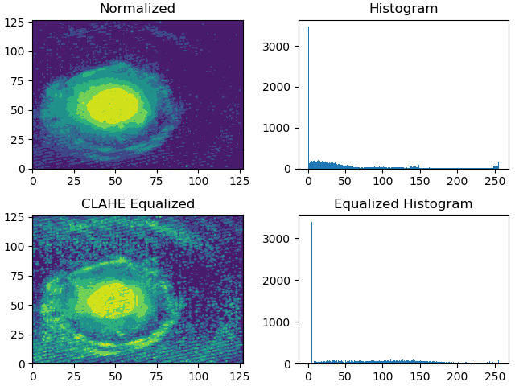|

When Canny is applied with the mean and median parameter pairs, we get a noticeable different result.

| Normalized |
|:-:|
|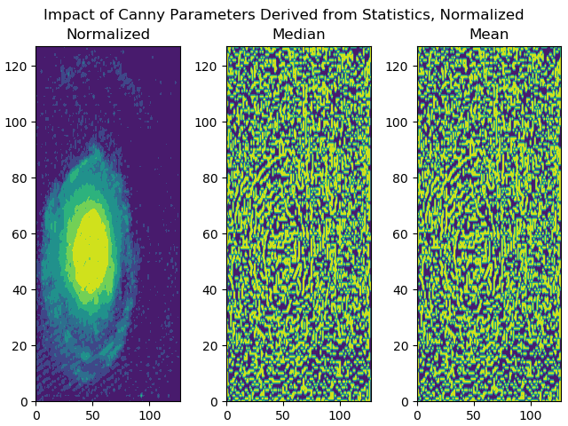|
| Global Equalized |
|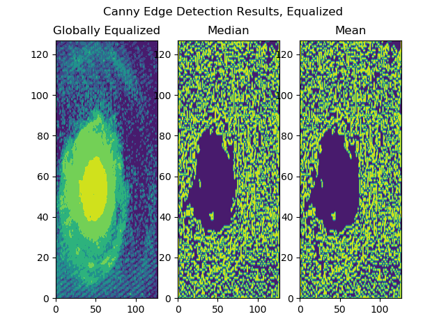|
| CLAHE Equalized |
|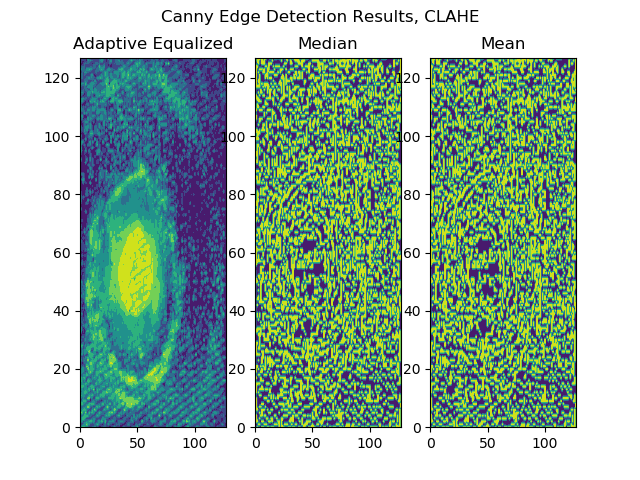|

A clear difference is that the Canny results from the globally equalized frame has a more distinct area than the CLAHE equalized results. This makes it easier for border detection algorithms to detect the area.

## DEVELOPER NOTES
  + The search takes several hours to run (8+ hours) on the developer machine. If you want to run the scripts yourself, make sure your machine is up to the task.
  + It is a ham-fisted approach, but there is currently no way of narrowing down the range.
  + The script is not perfect, there is likely a problem with it
