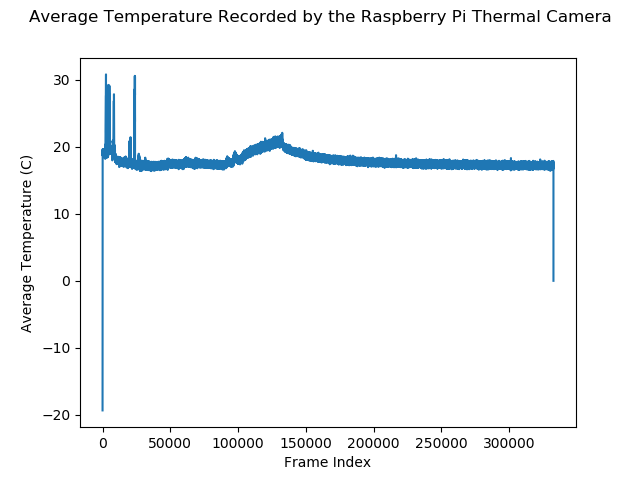

# Process Data Results

This section is about the results recorded with the Raspberry Pi thermal camera and any interesting results from processing it.

## Plots
These plots show data from the file [pi-camera-data-127001-2019-10-14T12-41-20](Data/pi-camera-data-127001-2019-10-14T12-41-20.hdf5).

The plot below shows the maximum temperature recorded by the thermal camera and interesting dynamics can be observed in the plot.

The plot below shows the maximum temperature from frame 90000 to 96000. A clear increasing dynamic can be seen in the beginning followed by a mostly decreasing dynamic. This increasing dynamic is from the main triangular body of the arrow shape

