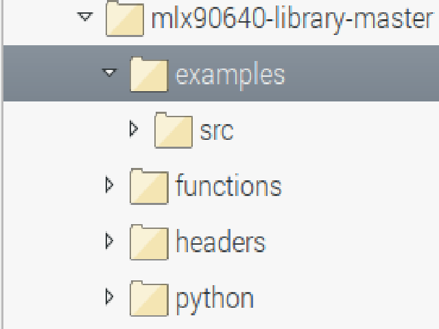

# Rasperry Pi Thermal Camera Scripts

This folder holds copies of the scripts desgined to run on Raspberry Pi's (tested on ) with a  thermal camera
connected via Pimoroni 

## Software Requirements
- [Python v3+](https://www.python.org/download/releases/3.0/)
- [MLX90640 library](https://github.com/pimoroni/mlx90640-library)
- [H5Py](https://www.h5py.org/)
- [Numpy](https://www.numpy.org/)
- [Breakout Garden Library](https://github.com/pimoroni/breakout-garden)

## Summary

The MLX90640 is a thermal camera with 32x24 resolution and was chosen for its temperature range of -40 to 300 degrees Celcius. This covers around 90% of the temperature range (based off predicted maximum temperature) predicted by the model.

The idea is to use this thermal camera to collect thermal data during a LBAM (Laser Based Additive Manufacturing) process in a relatively inexpensive manner that can be processed later. As the data can be processed by more power machines offline,
the primary goal of the code is to collect the temperature values and log them securely. As a HDF5 data structure has [developed](../WriteDataToHDF5/ReadMe.md) as part of this project
the store all the data logged and during a run in a single file, the data will also be logged in a HDF5 file so it can be added to the file later.

The scripts are based off the examples provided in the MLX90640 library. The examples mostly relate to collecting the values, producing and displaying
thermal images.

## Preparation

The Raspberry Pi needs to have the MLX90640 library downloaded and unpacked. The library is organized as follows.

The rawval.cpp file needs to be placed in the examples/src folder and the log-to-hdf5.py file needs to be placed in the oython folder.

The source code in examples/src is compiled by calling the make command in the root directory of the library. The Makefile supplied by the library compiled the source code and makes sure that the library files are included in the compilation. The [Makefile](Makefile) supplied in this repository has been modified to compile the [rawval](rawval.cpp) file and the other examples under these conditions. An already compiled rawval is [supplied](rawval). It is recommended that users compile their own to ensure that the appropriate paths are set.

The author notes that a custom make file could be made that only compiles rawval.

The user needs to check that the [log-to-hdf5](log-to-hdf5.py) file has the correct path to the [compiled rawval](rawval). This Python script calls this executable and proccesses the returned data.

## Scripts
### [Rawval](rawval.cpp)

The rawval script is a modified version of the example rawrgb. It collects and decodes the temperature values from the thermal camera and sends the values along stdout as a byte string of length 3072 bytes. It is a collection of 768 float values each of which is 4 bytes. The values are sent out via stdout pip so it can be collected and processed by the log-to-hdf5.py file.

### [Log-to-HDF5](log-to-hdf5.py)

This Python script starts the Rawval executable, collects the bytes sent by it and saves it into a HDF5 file.

The HDF5 file name is based off the current date and time in [ISO format](https://en.wikipedia.org/wiki/ISO_8601) and the wlan0 (address on the network IP address). The file is called pi-camera-data-IP-YYYY-MM-DDTHH-MM-SS-mmmmmm.hdf5. The current date and time is collected in the isoformat and the semi-colons of the time is replaced by hypons and the decimal point between the seconds and milliseconds is also replaced by a hypon. The IP address is used with the dots removed

A dataset called pi-camera-1 is created to collect information from the assumed only thermal camera to be connected. Future updates will name other cameras incrementally (i.e. pi-camera-2,pi-camera-3 etc.). It is created with an initial size of (24,32,1). The dataset is set to have maximum "unlimited" frames and can be resized at will up to 2^64 elements. The most recent frame in the dataset is updated with the collected data reshaped to a 24,32 matrix. The dataset is then increased by one frame in size for the next iteration of the loop.

The program has the following arguments.
- --fps <num>
  - Capture frame rate. Default 4 fps
  - Supported frame rates are (1,2,4,8,32,64)
  - Increasing the frame rate will obviously increase the end size of the file
- --skip <num>
  - Number of frames to skip during the entire run of the program.
  - Default is 2 frames.
- --time <num>
  - How long the program should run for in seconds (e.g. to have it run for 1 min you'd use --time 60, for one hour it's --time 3600 etc.)
  - The program checks how many seconds has elapsed from before the rawval executable is called. If a limit has been set and the elapsed time exceeds it, the program exits the loop.
  - By default the program runs for an inf amount of time.
- --help,--h
  - Prints helper information about the arguments.
  - Generated by argument parser class.
  
When the program exits the main loop, the following statistics are printed to the screen for the user's benefit.
- Runtime in minutes and seconds
- Estimated frame rate based off the runtime and the number of frames collected
  - Estimate is calculated as runtime in seconds divided by number of frames stored in first dataset.
  - The purpose of this is as a performance measure. Ideally they should be as close as possible.
- Number of datasets collected
- Name, shape and size of dataset in Mb

Afterwards the file is closed to ensure it can be inspected afterwards.

### [Rawvallog](rawvallog.cpp)

This program is the C++ equivalent of log-to-hdf5.py. It creates a HDF5 files based off the local system date and time and the IP address of the Pi with the dots removed. The file name differs fromm the Python script by not having the milliseconds in the file name.

pi-camera-data-IP-YYYY-MM-DDTHH-MM-SS.hdf5

The program has the following arguments.
  - FPS : Target frames per second
  - Time : Time limit in seconds.
  
**At present to set the time limit you have to set the target frames per second.**

E.g. sudo ./examples/rawvallog 16 60

When the program exits the main loop, the following statistics are printed to the screen (currently not working properly)
 - Runtime in minutes and seconds
 - Estimated frame rate based off the runtime and the number of frames collected.
 - Size of the first dataset (pi-camera-1).

### [Makefile](Makefile)

This modified make file is a slightly modified version of the one in the library. The modifications mean that the [rawval](rawval.cpp) is compiled along with the other examples in the examples folder in the MLX90640 library.

### [scp-copy-hdf5files](scp-copy-hdf5files.bat)

This Batch file is a single line command that connects to the Raspberry Pi via SSH and copies all HDF5 files to the current folder. Users will need to modify the file to ensure the IP address used and the file path of the HDF5 files match their device. The purpose of the script is to simplify collecting the data during regular use.

### [scp-copy-programfiles](scp-copy-programfiles.bat)

This Batch file is script that copies the program files 
 - rawval.cpp
 - log-to-hdf5.py
 - rawval.exe
 - rawvallog.cpp
 - rawvallog.exe 
to the current working directory.

### [build_rawlog](build_rawlog.sh)

Bash script to call g++ to build object file and executable for rawvallog.cpp. Uses HDF5's h5c++ utility to include HDF5 libraries in the file. The paths are currently set for source files to be in relative folder examples/src and puts the executable in relative folder example.

## [getpifiles](getpifiles.py)

Python script that performs the same function as scp-copy-hdf5files. It defines and calls a function called getHDF5FilesFromPi which iterates through the supplied ip addresses, connects to each one via SSH and copies files to the current working directory.

getHDF5FilesFromPi arguments:
 - ips : List of IPs for a set of Raspberry Pis.
 - passwords : Login passwords for each Pi supplied in ips. Assumes username is pi.
 - target_dir : Target directory where HDF5 files are theoretically stored. Default : /home/pi/mlx90640-library-master.
 - logging : Flag to indicate to start logging to a file ssg_log.txt
 
 As the function is currently setup to receive passwords as plain text, it's obviously not secure to use. It uses [paramiko](http://www.paramiko.org/) to manage the SSH connection and the transport of files. *It is possible to set it up to use authorised SSH keys.
 
**This program is a proof of concept and should be not used as is**

If the user wants to use the code anyway, they should review the code before hand and change the IP addresses used and passwords accordingly.

## Performance

Below is a table showing the performance of the C++ and Python program when run at different target frames per second for a period of sixty seconds.

**log-to-hdf5.py**

| Target FPS    |   1  |   2  |   4  |   8  |   16  |   32  |  64  |
|---------------|:----:|:----:|:----:|:----:|:-----:|:-----:|:----:|
| Est. FPS      | 0.93 | 1.92 | 3.85 | 7.58 | 14.45 | 26.86 | 8.38 |
| Target Frames |  60  | 120  | 240  | 480  | 960   |  1920 | 3840 |
| Actual Frames |  57  | 116  | 232  | 457  | 869   |  1614 |  506 |

**rawvallog**

| Target FPS    |   1  |   2  |   4  |   8  |   16  |   32  |  64  |
|---------------|:----:|:----:|:----:|:----:|:-----:|:-----:|:----:|
| Est. FPS      | 1.01639 | 1.98361 | 3.93443 | 7.86885 | 15.6721 | 30.8525 | 8.32787 |
| Target Frames |  60  | 120  | 240  | 480  | 960   |  1920 | 3840 |
| Actual Frames |  62  | 121  | 240  | 480  | 956   |  1882 |  508 |

The cause of the large discrepency in performance for 64 frames per second is thought to be related to the I2C library. When run at 64 frames per second the following error message is printed to the screen even if the output is written to a log file.

*cnt > 4

This error message is produced by the function MLX90640_GetFrameData in [MLX90640_API.cpp](https://github.com/pimoroni/mlx90640-library/blob/master/functions/MLX90640_API.cpp) when the data is not ready for collection.

When the data is not ready for collection and the variable cnt is less than 4, an attempt is made to interact with the I2C bus to collect an error code and determine why. At the end of the analysis, cnt is incremeneted by 1. When cnt exceeds a value of 5, the error message is printed to the screen.

The variable cnt appears to be a counter for the number of times the camera was not ready while collecting a frame of data. The counter is no longer updated when it is greater than 4. It is displayed on the screen irrespective of any logging that might be occuring as it is printed along stderr stream.
