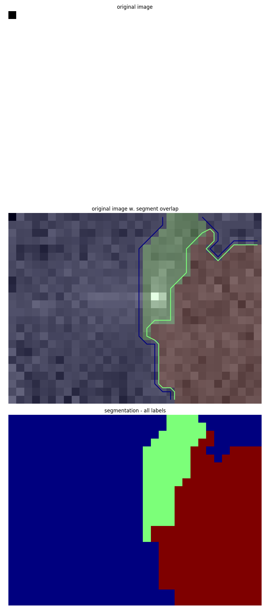
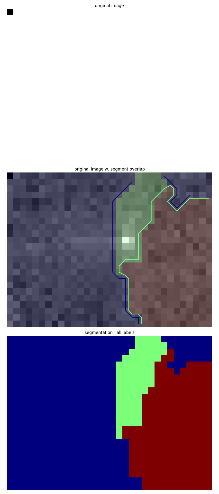
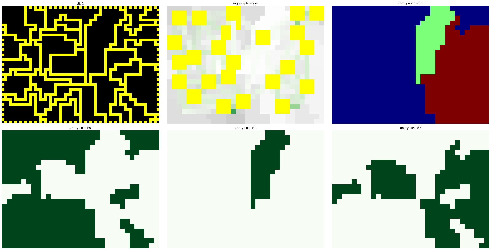
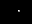
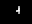

# Unsupervised Learning

**Based off Borovec J., Svihlik J., Kybic J., Habart D. (2017). Supervised and unsupervised segmentation using superpixels, model estimation, and Graph Cut. In: Journal of Electronic Imaging.**

A popular way of segmenting complex images is to train a machine learning network to differentiate between the objects or layers. This requires having a pretty good idea before hand of what the target is and having enough data to adequately describe it. One of the primary aims of this project is to detect when a defect has occured and identify the features that describe it. At this stage in the project, virtually no information has been collected related to defective builds to find these features. One of the main reaons for this is due to the scheduling differences between the project team and the technicians. This means it is difficult to regularly collect enough information to form an adequate dataset. Furthermore withouut a prior idea of what to look for, it is difficult to label the data to say when a defect occured. With this in mind, unsupervised learning approaches were investigated to see if machine learning can identify when a defect appears on its own.

A number of frameworks have been developed for a range of different data types. This folder is the results of trying different pre-trained/pre-coded frameworks.

## Frameworks

 - [pyImSegm](https://github.com/Borda/pyImSegm) is an image processing machine learning pipeline for segmenting images. It was originally developed to segments regions of cells but can be used with any image. It comes with the pretrained models for processing cells.
 
 - [GrabCut](https://docs.opencv.org/3.4/d8/d83/tutorial_py_grabcut.html) is an image segmentation method based off graph cutting. It improves upon other methods by proposing the segmentation problem as an optimization problem where the goal is to minimize the energy of segmentation. It has proven to be more effective that similar methods.
 
## pyImSegm
### Requirements
  - Numpy
  - Matplotlib
  - [pyImSegm](https://github.com/Borda/pyImSegm).
  - [pyGCO](https://github.com/Borda/pyGCO). Requires building C/C++ files. **Only successfully builds on Linux. See [here](https://github.com/yujiali/pygco/issues/5) for advice on how to compile for windows**
  - OpenCV
  
### Description

The pipeline was originally developed by [Borovec et. al](../../01%20Input/from%20UoS/Papers/ImageSegmentation/Supervised-and-unsupervised-segmentation-using-superpixels-model-estimation-and-graph-cut.pdf) for the use case of segmenting images of cells into activated and non-activated regions. The pipeline clusters the image into superpixels and trains a expectations maximization (EM) model on a set of color and texture features defining each one. The texture features are based off the response to the LM filter bank, a set of kernels that are convolved with an image to gauge how the color changes over the image space. These features are used to build a graph connecting neighbouring superpixels together after which graph cutting is performed to separate the superpixels into different classes. A mask is then built from this to apply to the image.

As not enough information has been gathered to form an adequate labelled dataset to train the model for our purpose, the unsupervised version of the pipeline is used. The folder [Features](Features) contains the results of applying the pipeline to thermal camera footage relying only on the texture features.

## GrabCut
### Requirements
 - Numpy
 - OpenCV
 
A popular school of segmentation that has emerged in recent years is the idea of representing an image as a graph and performing graph cutting. The nodes on the graph represent the pixels or some other graphical object and the weights that connect them a numerical representation of the difference between the nodes. The representation can be based off color (e.g. mean, median etc.) or texture. This form can be a compact way of representing the information in an image.

The goal of matting tools such as GrabCut is to form a pixel wise mapping describing a tool as being part of the foreground and background. The segmentation problem is to identify the parameters of the mapping model. The authors Rother et al propose the segmentation problem as by a Gibbs energy model where a small value indicates a good segmentation. Normally graph based methods only involve single stage learning where the relative features are calculated and the cutting is then performed. This method is instead iterative where the segmentation is learned over time. This approach has proven to be highly effectuve and very fast. It has been implemented in the popular OpenCV library.

One of the biggest advantages with this method is the minimal prior information required. Rather than requiring representative information about the foreground and background, the user can supply square masks where a wide, overly estimate area represents the foreground. The fact that high quality results can be obtained from impartial information is a great advantage in image processing algorithms where only partial information is known. As it's an optimization problem, it can have the tendency of arriving at poor conclusions.

As thermal camera footage has proven to be noisy, identifying the thermal boundary becomes a difficult problem and classical means don't tend to perform well with this kind of data. When GrabCut is applied to ther arrow shape thermal data we get the following results.

