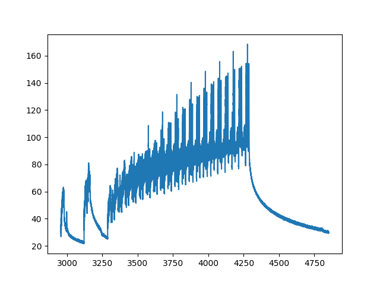
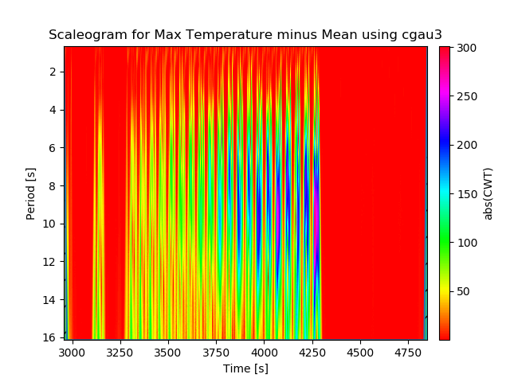
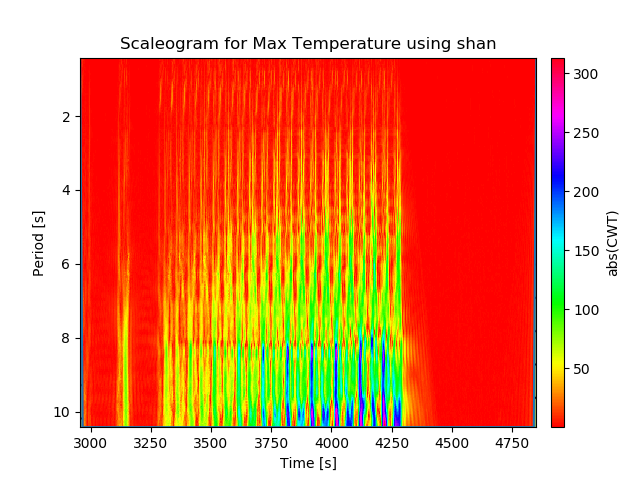
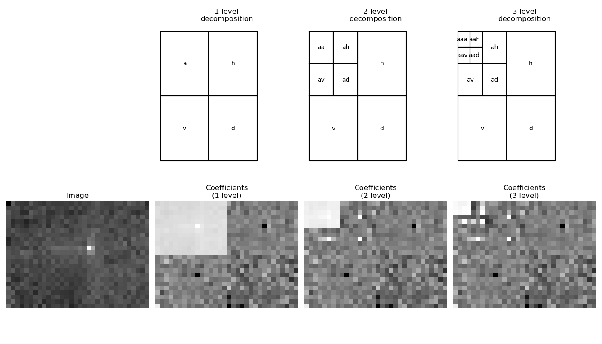
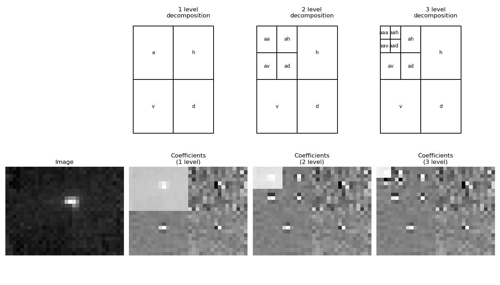

# Wavelet Analysis of Thermal Camera Data

Wavelet Analysis is a form of decomposition where a multi-dimensional dataset is broken down and represented by their responses to a specified signal. This signal, called a mother wavelet, is a closed function with unit energy containing a set of frequency dynamics identifiable by Fourier Transform. A given dataset's dynamics are discovered by convolving it with a warped version of the mother wavelet. It is modified by a scaling factor affecting its magnitude and a shift controlling the region being convolved. A high response to the warped wavelet, known as a daughter wavelet, indicates that presence if those particular frequency dynamics in the convolved region of the signal.

This analysis differs from the famous Fourier Transform as it factors in time revealing how the dynamics of the signal change over time compared to the "static" presence of dynamics across the whole signal. This is useful for volatile, dynamic signals whose behaviour is erratic and aperodic causing the results from the Fourier Transform to be meaningless. A windowed fourier analysis could reveal the static behaviour of a target period, but does not take into account the global behaviour due to the underlying mathematical assumptions. Also a windowed transform for this behaviour would suffer from leakage.

The temperature history recorded by the thermal camera is a good example of aperiodic behaviour. Whilst the data may contain regular dynamics for the build sections introduced by the regular pulsing of the laser, the remaining dynamics of temperature decay and any defects are likely not regular. Wavelet analysis has proven to be a valuable tool in defect or artifact detection in images (see Papers). The goal of wavelet analysys in this case is to see if it can detect the presence or the formation of defects from the thermal camera data

## Papers

The use of Dynamic IR Thermography and Wavelet Analysis in NDT, Leszek ROZANSKI, Jan 2014

Damage detection on composite materials with active thermography and digital image processing, A.P. Chrysafi, N. Athanasopoulos, N.J. Siakavellas, 2017

## Software Requirements
  - Python 3
  - PyWavelets
  - Scaleogram
  - Matplotlib
  - H5py
  - Numpy
  
## Discussion

### Maximum Temperature

The following figure shows the maximum temperature of each thermal image recorded during the arrow shape build. It can be clearly seen that there are distinct dynamics that correspond to building of certain section of the arrow shape. The two spikes at towards the end of the dataset have been confirmed to be data errors and should be ignored. As the sampling times for the build are not known, they are generated by taking the estimated frame rate of 30.92 frames per second as constant. The frame rate is based off number of total frames logged and the total run time of the recorded period.

As there is no general rule or equation for choosing the correct wavelet, a range of different wavelets were used. The list of supported wavelets under the PyWavelets library with their default parameters was iterated over and used. All the plots generated can be found in the [Plots](PLots) folder. Below are a couple of examples showing the response for the build period.

As it has been shown that subtracting the mean from the data can produce clearer responses, there are two sets of plots with and without the mean subtracted. The first example plot is the 3rd order Gau wavelet with the mean subtracted and the second example is the responde to the Shannon wavelet without the mean subtracted. In both cases, similar period dynamics can be observed with dynamics with periods between 8 and 12 seconds occuring 3750 and 4250 seconds.

### Image Decomposition

